

#  Mining Uplift - Complete Mod Wiki

> **Mod ID:** `uplift`

Mining Uplift is a Minecraft mod that adds **13 new ores and minerals**, full tool and armor sets with unique set bonus effects, a custom **Smelter** furnace, a **Gem Crusher** block, throwable **Mine Bombs**, a new **Cave Dimension** accessed through a **Cave Portal**, and a hostile **Stoneman** entity. This wiki documents every feature, item, block, recipe, and mechanic added by the mod.

---

## Table of Contents

- [New Ores & Materials](#new-ores--materials)
  - [Ruby](#ruby)
  - [Sapphire](#sapphire)
  - [Tourmaline](#tourmaline)
  - [Chromium](#chromium)
  - [Obsidian (Shards)](#obsidian-shards)
  - [Burning Diamond](#burning-diamond)
  - [Platinum](#platinum)
  - [Uranium](#uranium)
  - [Tasmanite](#tasmanite)
  - [Bloodstone](#bloodstone)
  - [Ender](#ender)
  - [Opal](#opal)
  - [Rose Gold](#rose-gold)
- [Special Items](#special-items)
  - [Gem Dust & Gemstone](#gem-dust--gemstone)
  - [Igniter](#igniter)
  - [Mine Bomb](#mine-bomb)
  - [Uranium Bomb](#uranium-bomb)
  - [Burning Diamond Dust](#burning-diamond-dust)
  - [Stone Meal & ](#stone-meal--stone-soup)
  - [Rose Golden Apple](#rose-golden-apple)
  - [Stoneman Spawn Egg](#stoneman-spawn-egg)
- [Tool & Weapon Stats](#tool--weapon-stats)
- [Armor Stats & Set Bonuses](#armor-stats--set-bonuses)
- [Special Blocks](#special-blocks)
  - [Gem Crusher](#gem-crusher)
  - [Smelter](#smelter)
  - [Igniter Fire](#igniter-fire)
  - [Gem Torches](#gem-torches)
- [The Cave Dimension](#the-cave-dimension)
  - [Cave Portal](#cave-portal)
- [Ore Generation](#ore-generation)
  - [Overworld Ores](#overworld-ores)
  - [Nether Ores](#nether-ores)
  - [End Ores](#end-ores)
  - [Cave Dimension Ores](#cave-dimension-ores)
- [Entities](#entities)
  - [Stoneman](#stoneman)
- [Effects](#effects)
  - [Flight](#flight)
- [Crafting](#crafting)
  - [Utility & Special Item Recipes](#utility--special-item-recipes)
  - [Ruby Recipes](#ruby-recipes)
  - [Sapphire Recipes](#sapphire-recipes)
  - [Tourmaline Recipes](#tourmaline-recipes)
  - [Chromium Recipes](#chromium-recipes)
  - [Obsidian Recipes](#obsidian-recipes)
  - [Burning Diamond Recipes](#burning-diamond-recipes)
  - [Platinum Recipes](#platinum-recipes)
  - [Uranium Recipes](#uranium-recipes)
  - [Bloodstone Recipes](#bloodstone-recipes)
  - [Ender Recipes](#ender-recipes)
  - [Tasmanite Recipes](#tasmanite-recipes)
  - [Opal Recipes](#opal-recipes)
  - [Rose Gold Recipes](#rose-gold-recipes)
- [Smelting](#smelting)
  - [Furnace Recipes](#furnace-recipes)
  - [Smelter Recipes](#smelter-recipes)
  - [Fuel Values](#fuel-values)
- [Backlog](#backlog)

---

## New Ores & Materials

### Ruby

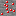 </img>  

A common red gemstone found in the Overworld and Cave Dimension. Ruby is the most accessible new gem and serves as a good early-game material upgrade.

| Property            | Value                      |
| ------------------- | -------------------------- |
| Ore Hardness        | 3.0                        |
| Ore Harvest Level   | 1 (Stone)                  |
| Drops XP            | Yes                        |
| Block Hardness      | 5.0 / Blast Resistance 6.0 |
| Block Harvest Level | 2 (Iron)                   |

---

### Sapphire

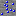  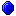 

A blue gemstone found deeper underground. Sapphire tools and armor are a step up from Ruby.

| Property            | Value                      |
| ------------------- | -------------------------- |
| Ore Hardness        | 3.0                        |
| Ore Harvest Level   | 2 (Iron)                   |
| Drops XP            | Yes                        |
| Block Hardness      | 5.0 / Blast Resistance 6.0 |
| Block Harvest Level | 2 (Iron)                   |

---

### Tourmaline

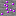 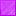 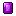 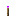

A vibrant gemstone with moderate stats. Tourmaline armor grants a powerful Jump Boost effect.

| Property            | Value                      |
| ------------------- | -------------------------- |
| Ore Hardness        | 3.0                        |
| Ore Harvest Level   | 2 (Iron)                   |
| Drops XP            | Yes                        |
| Block Hardness      | 5.0 / Blast Resistance 6.0 |
| Block Harvest Level | 2 (Iron)                   |

---

### Chromium

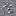   

A metallic ore smelted into ingots. Chromium has stats similar to Sapphire and grants Speed when worn as a full armor set.

| Property          | Value                      |
| ----------------- | -------------------------- |
| Ore Hardness      | 3.0                        |
| Ore Harvest Level | 2 (Iron)                   |
| Block Hardness    | 5.0 / Blast Resistance 6.0 |
| Block Light Level | 10                         |

---

### Obsidian (Shards)

   

Obsidian Shards are obtained by processing vanilla Obsidian in the **Smelter**. They can be crafted into extremely durable tools and armor. The Block of Obsidian is incredibly blast-resistant (1200).

| Property            | Value                          |
| ------------------- | ------------------------------ |
| Block Hardness      | 50.0 / Blast Resistance 1200.0 |
| Block Harvest Level | 2 (Iron)                       |

---

### Burning Diamond

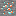  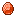 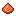 

An extremely rare, fiery gem. Burning Diamond ore emits light (level 5), and the block emits even more (level 10). Burning Diamond is also an incredibly powerful **furnace fuel** that smelts **200 items** per unit (25x coal). Burning Diamond Dust is created by processing a vanilla Diamond in the Smelter.

| Property          | Value                    |
| ----------------- | ------------------------ |
| Ore Hardness      | 3.0                      |
| Ore Harvest Level | 3 (Diamond)              |
| Ore Light Level   | 5                        |
| Drops XP          | Yes                      |
| Block Light Level | 10                       |
| Fuel Value        | 40,000 ticks (200 items) |

---

### Platinum

   

The pinnacle of Overworld metals. Platinum is extraordinarily rare and yields the strongest non-specialty tools and armor. Requires a harvest level of 4 (Burning Diamond-tier or higher pickaxe) to mine its ore.

| Property          | Value                      |
| ----------------- | -------------------------- |
| Ore Hardness      | 3.0                        |
| Ore Harvest Level | 4 (Burning Diamond)        |
| Block Hardness    | 5.0 / Blast Resistance 6.0 |

---

### Uranium

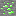   

A radioactive metal found high in the world (Y 46-256). Uranium tools and the Uranium Bomb make it a powerful mid-game material.

| Property          | Value                      |
| ----------------- | -------------------------- |
| Ore Hardness      | 3.0                        |
| Ore Harvest Level | 3 (Diamond)                |
| Block Hardness    | 5.0 / Blast Resistance 6.0 |

---

### Tasmanite

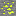  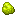 

A luminous mineral found throughout the Overworld. Tasmanite is primarily a fuel source (smelts **12 items**, 1.5x coal) and a crafting component. The Block of Tasmanite emits maximum light (level 15).

| Property          | Value                  |
| ----------------- | ---------------------- |
| Ore Hardness      | 3.0                    |
| Ore Harvest Level | 2 (Iron)               |
| Drops XP          | Yes                    |
| Block Light Level | 15                     |
| Fuel Value        | 2,400 ticks (12 items) |

---

### Bloodstone

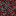 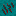 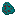

A dark gem found only in the **Nether**. Bloodstone armor provides constant Instant Health but comes with severe debuffs - a balanced risk/reward armor set.

| Property          | Value               |
| ----------------- | ------------------- |
| Ore Hardness      | 3.0                 |
| Ore Harvest Level | 2 (Iron)            |
| Drops XP          | Yes                 |
| Found In          | Nether (Netherrack) |

---

### Ender

  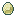 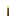

A powerful gem found only in **The End**. Ender tools have the highest durability in the mod (2,450 uses), and the full armor set grants **Flight**.
Ender gems can be obtained by mining **Ender Ore** in The End or as a rare drop from **Endermen**.

| Property          | Value               |
| ----------------- | ------------------- |
| Ore Hardness      | 3.0                 |
| Ore Harvest Level | 3 (Diamond)         |
| Drops XP          | Yes                 |
| Found In          | The End (End Stone) |

---

### Opal

   

A rare gem found only underground and in the Cave Dimension. Opal currently has no tool or armor set but is highly valuable as **Gem Crusher** input (9 Gem Dust per Opal).

| Property          | Value       |
| ----------------- | ----------- |
| Ore Hardness      | 3.0         |
| Ore Harvest Level | 3 (Diamond) |
| Drops XP          | Yes         |

---

### Rose Gold

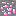   

A lustrous metal found in the Cave Dimension. Rose Gold is used to craft two unique legendary weapons and the powerful Rose Golden Apple. Its weapons have very low durability (100) but extremely high damage.

| Property          | Value                      |
| ----------------- | -------------------------- |
| Ore Hardness      | 3.0                        |
| Ore Harvest Level | 2 (Iron)                   |
| Block Hardness    | 5.0 / Blast Resistance 6.0 |

---

## Special Items

### Gem Dust & Gemstone

 **Gem Dust** - A fine powder obtained by crushing gems in the **Gem Crusher**. 9 Gem Dust can be crafted into a **Gemstone** block, which is used to build **Cave Portal** frames.

 **Gemstone** - A glowing block (similar to Glowstone) crafted from 9 Gem Dust. Acts as the portal frame material for the Cave Portal.

---

### Igniter

A special tool crafted from a Burning Diamond and Flint & Steel. It has **200 durability** and serves three special purposes:

| Action                 | Durability Cost |
| ---------------------- | --------------- |
| Place Igniter Fire     | 1               |
| Light Campfire         | 1               |
| Light an Unlit Smelter | 50              |
| Activate a Cave Portal | 100             |

---

### Mine Bomb

A throwable explosive (max stack: 4). On impact, it creates a column of **power-4** explosions from the impact point all the way down to **Y=0 (bedrock)**. Ideal for strip-mining entire columns.

---

### Uranium Bomb

A devastating throwable explosive (max stack: 4). On impact, it creates **power-20** explosions in a 5-block deep column. Far more destructive than the Mine Bomb but limited in vertical range.

---

### Burning Diamond Dust

Obtained by processing a vanilla Diamond in the Smelter. Four Burning Diamond Dust can be crafted into a Burning Diamond.

---

### Stone Meal & Stone Soup

 **Stone Meal** - Dropped by the Stoneman entity (0-1 per kill). Used to craft Stone Soup.

 **Stone Soup** - A food item restoring **6 hunger** and **0.8 saturation**. Returns a Bowl when consumed in Survival mode. Max stack: 1.

---

### Rose Golden Apple

An incredibly powerful food with the following effects:

| Effect          | Duration | Amplifier |
| --------------- | -------- | --------- |
| Absorption      | 4 min    | 0         |
| Regeneration    | 20 sec   | 2         |
| Fire Resistance | 2 min    | 0         |
| Resistance      | 2 min    | 0         |

Hunger: 12 | Saturation: 10.0 | Always edible

---

### Stoneman Spawn Egg

**Stoneman Spawn Egg**

A spawn egg for the Stoneman entity. Max stack: 16.

> **Note:** The spawn egg uses Minecraft's built-in spawn egg template (tinted colors), so it does not have a dedicated standalone item texture file in this repo.

---

## Tool & Weapon Stats

All custom tools follow standard Minecraft tool types (Sword, Pickaxe, Axe, Shovel, Hoe) with the following material stats:

| Material        | Harvest Level | Durability | Efficiency | Enchantability | Repair Item     |
| --------------- | ------------- | ---------- | ---------- | -------------- | --------------- |
| Ruby            | 1             | 200        | 5.0        | 20             | Ruby            |
| Sapphire        | 2             | 750        | 6.0        | 10             | Sapphire        |
| Chromium        | 2             | 700        | 6.0        | 12             | Chromium Ingot  |
| Tourmaline      | 2             | 600        | 7.0        | 15             | Tourmaline      |
| Obsidian        | 3             | 1,800      | 7.0        | 10             | Obsidian Shard  |
| Burning Diamond | 4             | 1,650      | 9.0        | 15             | Burning Diamond |
| Platinum        | 4             | 2,150      | 10.0       | 10             | Platinum Ingot  |
| Uranium         | 3             | 1,100      | 8.0        | 15             | Uranium Ingot   |
| Ender           | 3             | 2,450      | 9.0        | 20             | Ender Gem       |
| Rose Gold       | 4             | 100        | 10.0       | 0              | Rose Gold Ingot |

### Weapon Attack Damage

| Weapon          | Sword | Pickaxe | Axe | Shovel |
| --------------- | ----- | ------- | --- | ------ |
| Ruby            | 6     | 3       | 9   | 3.5    |
| Sapphire        | 6     | 4       | 9   | 4.5    |
| Chromium        | 6     | 4       | 9   | 4.5    |
| Tourmaline      | 6     | 5       | 9   | 5.5    |
| Obsidian        | 7     | 5       | 9   | 4.5    |
| Burning Diamond | 8     | 5       | 9   | 6.5    |
| Platinum        | 10    | 6       | 11  | 7.0    |
| Uranium         | 7     | 5       | 9   | 5.5    |
| Ender           | 8     | 5       | 9   | 5.5    |

### Rose Gold Weapons (Special)

Rose Gold only has a **Sword** and **Axe**, each with unique effects when held:

| Weapon            | Attack Damage | Special Effect                         |
| ----------------- | ------------- | -------------------------------------- |
| Rose Golden Sword | 12            | Grants **Speed III** while held        |
| Rose Golden Axe   | 12            | Grants **Invisibility III** while held |

Both have only **100 durability** and **0 enchantability** - extremely powerful but fragile and unenchantable.

---

## Armor Stats & Set Bonuses

Armor values shown as: Boots / Leggings / Chestplate / Helmet

| Material        | Durability Factor | Protection (B/L/C/H) | Toughness | Enchantability | Full Set Bonus                                                   |
| --------------- | ----------------- | -------------------- | --------- | -------------- | ---------------------------------------------------------------- |
| Ruby            | 5                 | 2/4/5/2              | 0.0       | 20             | **Resistance**                                                   |
| Sapphire        | 9                 | 2/5/6/2              | 1.0       | 10             | **Water Breathing**                                              |
| Chromium        | 8                 | 2/5/6/2              | 1.0       | 12             | **Speed**                                                        |
| Tourmaline      | 6                 | 3/5/6/3              | 0.0       | 15             | **Jump Boost II**                                                |
| Obsidian        | 18                | 3/5/5/3              | 2.5       | 10             | **Night Vision**                                                 |
| Burning Diamond | 17                | 4/7/9/4              | 2.0       | 15             | **Fire Resistance**                                              |
| Platinum        | 21                | 5/8/9/5              | 3.0       | 10             | **Strength**                                                     |
| Uranium         | 12                | 3/6/8/3              | 1.0       | 15             | **Haste III**                                                    |
| Bloodstone      | 3                 | 6/6/6/6              | 4.0       | 5              | **Instant Health** + Blindness + Slowness V + Mining Fatigue III |
| Ender           | 24                | 3/6/8/3              | 2.0       | 20             | **Flight** (custom)                                              |

> **Note:** Set bonuses activate only when all 4 armor pieces are worn. The effect persists with infinite duration and is instantly removed when any piece is unequipped. Each set displays colored particles when active.

### Armor Durability Reference

Durability = Durability Factor x Base (Boots: 27, Leggings: 30, Chestplate: 35, Helmet: 25)

| Material        | Boots | Leggings | Chestplate | Helmet |
| --------------- | ----- | -------- | ---------- | ------ |
| Ruby            | 135   | 150      | 175        | 125    |
| Sapphire        | 243   | 270      | 315        | 225    |
| Chromium        | 216   | 240      | 280        | 200    |
| Tourmaline      | 162   | 180      | 210        | 150    |
| Obsidian        | 486   | 540      | 630        | 450    |
| Burning Diamond | 459   | 510      | 595        | 425    |
| Platinum        | 567   | 630      | 735        | 525    |
| Uranium         | 324   | 360      | 420        | 300    |
| Bloodstone      | 81    | 90       | 105        | 75     |
| Ender           | 648   | 720      | 840        | 600    |

---

## Special Blocks

### Gem Crusher

A functional block that converts gems and materials into **Gem Dust** when right-clicked with a valid item in your main hand. No fuel is required - simply hold the item and interact.

| Input Item        | Gem Dust Output |
| ----------------- | --------------- |
| Ruby              | 1               |
| Sapphire          | 3               |
| Tourmaline        | 3               |
| Diamond (vanilla) | 6               |
| Emerald (vanilla) | 6               |
| Obsidian Shard    | 6               |
| Burning Diamond   | 9               |
| Opal              | 9               |
| Ender Gem         | 9               |

| Property      | Value                      |
| ------------- | -------------------------- |
| Hardness      | 3.5 / Blast Resistance 3.0 |
| Harvest Level | 1 (Stone Pickaxe)          |

---

### Smelter

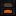

A specialized furnace made from **Obsidian**. The Smelter must be **lit with an Igniter** (costs 50 durability) to function. It processes ores and materials using the custom `uplift:uplift` recipe type - recipes not available in normal furnaces.

| Property     | Value                                                 |
| ------------ | ----------------------------------------------------- |
| Hardness     | 50.0 / Blast Resistance 1200.0                        |
| Light Level  | 12 (when lit)                                         |
| Lit By       | Igniter (50 durability cost)                          |
| Smelt Time   | 150 ticks per item (7.5 sec)                          |
| Lit Duration | 200 smelts (fuel drains only while actively smelting) |

> See [Smelter Recipes](#smelter-recipes) for the full Furnace and Smelter recipe list.

---

### Igniter Fire

A special orange-red fire placed by the Igniter. Deals different damage depending on weather:

| Condition   | Players               | Mobs                   |
| ----------- | --------------------- | ---------------------- |
| Not Raining | Set on fire for 1 sec | 6 damage + 30 sec fire |
| Raining     | 1 fire damage         | 4 fire damage          |

---

### Gem Torches

Custom colored torches crafted with the resource on top of Coal on top of a Stick. Each torch emits **light level 14**. Available variants:

-  Ruby Torch
-  Burning Diamond Torch
-  Sapphire Torch
-  Tourmaline Torch
-  Obsidian Torch
- 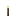 Ender Torch
-  Opal Torch
-  Tasmanite Torch (crafted differently - see [Crafting](#tasmanite-torch))

All torches can be placed on walls (wall torch variant included).

---

## The Cave Dimension

The Cave Dimension ("The Cave") is a custom underground dimension consisting entirely of stone, ores, and caves.

| Property        | Value                                  |
| --------------- | -------------------------------------- |
| Max Height      | 70 blocks                              |
| Sea Level       | 24                                     |
| Bedrock Floor   | Y = 0                                  |
| Bedrock Ceiling | Y = 65                                 |
| Surface         | Stone (no grass, dirt, or sky)         |
| Weather         | None (no rain)                         |
| Daylight Cycle  | Fixed (always dim)                     |
| Can Respawn     | No (deaths send you back to Overworld) |
| Beds            | Explode (like the Nether)              |
| Fog Color       | Black                                  |

**Biome:** Ore Biome - A custom biome with cave carvers and an extremely rich ore distribution. All mod ores spawn here at significantly higher rates than in the Overworld (see [Ore Generation](#ore-generation)).

**Mob Spawns in Cave Dimension:**

| Entity        | Spawn Weight | Group Size |
| ------------- | ------------ | ---------- |
| Stoneman      | 12           | 2-4        |
| Zombie        | 8            | 1-3        |
| Skeleton      | 8            | 1-3        |
| Creeper       | 6            | 1-2        |
| Spider        | 6            | 1-2        |
| Bat (ambient) | 10           | 2-4        |

### Cave Portal

A portal block built from a **Gemstone** frame (just like a Nether Portal frame is made of Obsidian). The portal supports variable sizes from 2x3 to 21x21 and is activated with the **Igniter** (costs 100 durability).

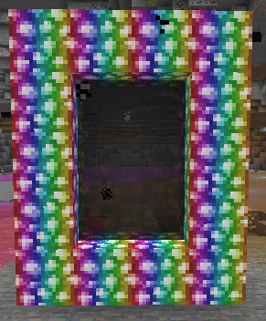

**How to build:**

1. Build a portal frame out of **Gemstone** blocks (rectangular, minimum 2x3 interior)
2. Use the **Igniter** on the inside of the frame
3. Step into the portal to teleport

**Teleport behavior:**

- Teleports between the **Overworld** and the **Cave Dimension** (1:1 coordinate scale)
- Applies: Nausea (6 sec), Blindness (2 sec), Slow Falling (3 sec) on teleportation
- Portal cooldown: 5 seconds (100 ticks)
- Bi-directional portal linking is persisted across sessions

> **Crafting (Shaped):** The Cave Portal can be crafted from Gemstone blocks (see the recipe in [Crafting](#gemstone-block)). The portal texture is animated, so the recipe display uses a placeholder icon.

---

## Ore Generation

### Overworld Ores

|                                                                                                                                     | Ore                 | Veins/Chunk | Vein Size | Y Range | Harvest Level |
| ----------------------------------------------------------------------------------------------------------------------------------- | ------------------- | ----------- | --------- | ------- | ------------- |
|             | Ruby Ore            | 22          | 10        | 0-64    | 1 (Stone)     |
|         | Sapphire Ore        | 6           | 8         | 0-32    | 2 (Iron)      |
|           | Chromium Ore        | 6           | 8         | 0-32    | 2 (Iron)      |
|       | Tourmaline Ore      | 6           | 8         | 0-32    | 2 (Iron)      |
|         | Platinum Ore        | 1           | 4         | 0-8     | 4 (Platinum)  |
|  | Burning Diamond Ore | 1           | 4         | 0-12    | 3 (Diamond)   |
|        | Tasmanite Ore       | 12          | 8         | 0-128   | 2 (Iron)      |
|             | Opal Ore            | 1           | 6         | 0-24    | 3 (Diamond)   |
|          | Uranium Ore         | 4           | 6         | 46-256  | 3 (Diamond)   |

### Nether Ores

|                                                                                                                                | Ore            | Veins/Chunk | Vein Size | Y Range | Found In   |
| ------------------------------------------------------------------------------------------------------------------------------ | -------------- | ----------- | --------- | ------- | ---------- |
|  | Bloodstone Ore | 8           | 8         | 0-128   | Netherrack |

### End Ores

|                                                                                                                           | Ore       | Veins/Chunk | Vein Size | Y Range | Found In  |
| ------------------------------------------------------------------------------------------------------------------------- | --------- | ----------- | --------- | ------- | --------- |
|  | Ender Ore | 32          | 12        | 0-256   | End Stone |

### Cave Dimension Ores

The Cave Dimension has dramatically increased ore rates. All ores generate between Y 0-70.

|                                                                                                                                     | Ore                    | Veins/Chunk | Vein Size |
| ----------------------------------------------------------------------------------------------------------------------------------- | ---------------------- | ----------- | --------- |
|             | Ruby Ore               | 30          | 10        |
|         | Sapphire Ore           | 14          | 8         |
|           | Chromium Ore           | 14          | 8         |
|       | Tourmaline Ore         | 14          | 8         |
|         | Platinum Ore           | 3           | 4         |
|  | Burning Diamond Ore    | 2           | 4         |
|        | Tasmanite Ore          | 20          | 10        |
|             | Opal Ore               | 6           | 6         |
|        | Rose Gold Ore          | 14          | 6         |
|          | Uranium Ore            | 6           | 8         |
|             | Gemstone               | 10          | 8         |
|                                           | Coal Ore (vanilla)     | 50          | 14        |
|                                           | Iron Ore (vanilla)     | 26          | 10        |
|                                           | Gold Ore (vanilla)     | 12          | 8         |
|                                        | Diamond Ore (vanilla)  | 3           | 8         |
|                                        | Emerald Ore (vanilla)  | 4           | 6         |
|                                          | Lapis Ore (vanilla)    | 12          | 8         |
|                                       | Redstone Ore (vanilla) | 12          | 10        |
|                                           | Obsidian (vanilla)     | 10          | 8         |

> **Note:** Rose Gold Ore spawns **only** in the Cave Dimension.

---

## Entities

### Stoneman

A hostile mob that spawns in the **Cave Dimension**. Resembles a zombie-like creature made of stone.

| Stat            | Value              |
| --------------- | ------------------ |
| Health          | 10 HP (5 hearts)   |
| Base Attack     | 2.0                |
| Attack (Easy)   | 1.0                |
| Attack (Normal) | 2.0                |
| Attack (Hard)   | 3.0                |
| Movement Speed  | 0.25               |
| Classification  | Monster            |
| Spawn Weight    | 12 (groups of 2-4) |

**Special Behaviors:**

- **Immune to fall damage**
- **Cannot see invisible players** - Invisibility potion completely hides you (use the Rose Golden Axe!)
- Uses Villager sounds (ambient, hurt, death)
- Does not spawn on Peaceful difficulty

**Drops (on player kill):**

| Drop       | Amount |
| ---------- | ------ |
| Ruby       | 0-1    |
| Sapphire   | 0-1    |
| Tourmaline | 0-1    |
| Stone Meal | 0-1    |

---

## Effects

### Flight

Granted by wearing a full set of **Ender armor**. Allows creative-mode flight.

| Property | Value                                                          |
| -------- | -------------------------------------------------------------- |
| Type     | Beneficial                                                     |
| Source   | Full Ender armor set bonus                                     |
| Notes    | Effect is removed immediately if any armor piece is unequipped |

---

## Crafting

### Utility & Special Item Recipes

#### Gem Crusher

<table style="border-collapse: collapse;">
<tr>
<td align="center" style="border: 1px solid #555; width: 40px; height: 40px; padding: 4px;"></td>
<td align="center" style="border: 1px solid #555; width: 40px; height: 40px; padding: 4px;"></td>
<td align="center" style="border: 1px solid #555; width: 40px; height: 40px; padding: 4px;"></td>
<td rowspan="3" align="center" width="44" style="vertical-align: middle;">➞</td>
<td rowspan="3" align="center" style="vertical-align: middle; white-space: normal;"></td>
</tr>
<tr>
<td align="center" style="border: 1px solid #555; width: 40px; height: 40px; padding: 4px;"></td>
<td align="center" style="border: 1px solid #555; width: 40px; height: 40px; padding: 4px;"></td>
<td align="center" style="border: 1px solid #555; width: 40px; height: 40px; padding: 4px;"></td>
</tr>
<tr>
<td align="center" style="border: 1px solid #555; width: 40px; height: 40px; padding: 4px;"></td>
<td align="center" style="border: 1px solid #555; width: 40px; height: 40px; padding: 4px;"></td>
<td align="center" style="border: 1px solid #555; width: 40px; height: 40px; padding: 4px;"></td>
</tr>
</table>

> **Crafting (Shaped):** 6 Stone + 2 Platinum Ingots ➞ 1 Gem Crusher

---

#### Smelter (Unlit)

<table style="border-collapse: collapse;">
<tr>
<td align="center" style="border: 1px solid #555; width: 40px; height: 40px; padding: 4px;"></td>
<td align="center" style="border: 1px solid #555; width: 40px; height: 40px; padding: 4px;"></td>
<td align="center" style="border: 1px solid #555; width: 40px; height: 40px; padding: 4px;"></td>
<td rowspan="3" align="center" width="44" style="vertical-align: middle;">➞</td>
<td rowspan="3" align="center" style="vertical-align: middle; white-space: normal;">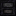</td>
</tr>
<tr>
<td align="center" style="border: 1px solid #555; width: 40px; height: 40px; padding: 4px;"></td>
<td align="center" style="border: 1px solid #555; width: 40px; height: 40px; padding: 4px;"></td>
<td align="center" style="border: 1px solid #555; width: 40px; height: 40px; padding: 4px;"></td>
</tr>
<tr>
<td align="center" style="border: 1px solid #555; width: 40px; height: 40px; padding: 4px;"></td>
<td align="center" style="border: 1px solid #555; width: 40px; height: 40px; padding: 4px;"></td>
<td align="center" style="border: 1px solid #555; width: 40px; height: 40px; padding: 4px;"></td>
</tr>
</table>

> **Crafting (Shaped):** 8 Obsidian ➞ 1 Smelter (Unlit). Light it with the Igniter.

---

#### Gemstone Block

<table style="border-collapse: collapse;">
<tr>
<td align="center" style="border: 1px solid #555; width: 40px; height: 40px; padding: 4px;"></td>
<td align="center" style="border: 1px solid #555; width: 40px; height: 40px; padding: 4px;"></td>
<td align="center" style="border: 1px solid #555; width: 40px; height: 40px; padding: 4px;"></td>
<td rowspan="3" align="center" width="44" style="vertical-align: middle;">➞</td>
<td rowspan="3" align="center" style="vertical-align: middle; white-space: normal;"></td>
</tr>
<tr>
<td align="center" style="border: 1px solid #555; width: 40px; height: 40px; padding: 4px;"></td>
<td align="center" style="border: 1px solid #555; width: 40px; height: 40px; padding: 4px;"></td>
<td align="center" style="border: 1px solid #555; width: 40px; height: 40px; padding: 4px;"></td>
</tr>
<tr>
<td align="center" style="border: 1px solid #555; width: 40px; height: 40px; padding: 4px;"></td>
<td align="center" style="border: 1px solid #555; width: 40px; height: 40px; padding: 4px;"></td>
<td align="center" style="border: 1px solid #555; width: 40px; height: 40px; padding: 4px;"></td>
</tr>
</table>

> **Crafting (Shaped):** 9 Gem Dust ➞ 1 Gemstone

#### Gem Dust from Gemstone

<table style="border-collapse: collapse;">
<tr>
<td align="center" style="border: 1px solid #555; width: 40px; height: 40px; padding: 4px;"></td>
<td align="center" width="44" style="vertical-align: middle;">➞</td>
<td align="center" style="vertical-align: middle; white-space: normal;"></td>
</tr>
</table>

> **Crafting (Shapeless):** 1 Gemstone ➞ 3 Gem Dust

---

#### Igniter

<table style="border-collapse: collapse;">
<tr>
<td align="center" style="border: 1px solid #555; width: 40px; height: 40px; padding: 4px;"></td>
<td align="center" style="border: 1px solid #555; width: 40px; height: 40px; padding: 4px;"></td>
<td align="center" width="44" style="vertical-align: middle;">➞</td>
<td align="center" style="vertical-align: middle; white-space: normal;"></td>
</tr>
</table>

> **Crafting (Shapeless):** 1 Burning Diamond + 1 Flint & Steel ➞ 1 Igniter

---

#### Mine Bomb

<table style="border-collapse: collapse;">
<tr>
<td align="center" style="border: 1px solid #555; width: 40px; height: 40px; padding: 4px;"></td>
<td align="center" style="border: 1px solid #555; width: 40px; height: 40px; padding: 4px;"></td>
<td align="center" style="border: 1px solid #555; width: 40px; height: 40px; padding: 4px;"></td>
<td rowspan="3" align="center" width="44" style="vertical-align: middle;">➞</td>
<td rowspan="3" align="center" style="vertical-align: middle; white-space: normal;"></td>
</tr>
<tr>
<td align="center" style="border: 1px solid #555; width: 40px; height: 40px; padding: 4px;"></td>
<td align="center" style="border: 1px solid #555; width: 40px; height: 40px; padding: 4px;"></td>
<td align="center" style="border: 1px solid #555; width: 40px; height: 40px; padding: 4px;"></td>
</tr>
<tr>
<td align="center" style="border: 1px solid #555; width: 40px; height: 40px; padding: 4px;"></td>
<td align="center" style="border: 1px solid #555; width: 40px; height: 40px; padding: 4px;"></td>
<td align="center" style="border: 1px solid #555; width: 40px; height: 40px; padding: 4px;"></td>
</tr>
</table>

> **Crafting (Shaped):** 4 Gem Dust + 1 Gunpowder ➞ 1 Mine Bomb

---

#### Uranium Bomb

<table style="border-collapse: collapse;">
<tr>
<td align="center" style="border: 1px solid #555; width: 40px; height: 40px; padding: 4px;"></td>
<td align="center" style="border: 1px solid #555; width: 40px; height: 40px; padding: 4px;"></td>
<td align="center" style="border: 1px solid #555; width: 40px; height: 40px; padding: 4px;"></td>
<td rowspan="3" align="center" width="44" style="vertical-align: middle;">➞</td>
<td rowspan="3" align="center" style="vertical-align: middle; white-space: normal;"></td>
</tr>
<tr>
<td align="center" style="border: 1px solid #555; width: 40px; height: 40px; padding: 4px;"></td>
<td align="center" style="border: 1px solid #555; width: 40px; height: 40px; padding: 4px;"></td>
<td align="center" style="border: 1px solid #555; width: 40px; height: 40px; padding: 4px;"></td>
</tr>
<tr>
<td align="center" style="border: 1px solid #555; width: 40px; height: 40px; padding: 4px;"></td>
<td align="center" style="border: 1px solid #555; width: 40px; height: 40px; padding: 4px;"></td>
<td align="center" style="border: 1px solid #555; width: 40px; height: 40px; padding: 4px;"></td>
</tr>
</table>

> **Crafting (Shaped):** 4 Uranium Ingots + 1 Gunpowder ➞ 1 Uranium Bomb

---

#### Stone Soup

<table style="border-collapse: collapse;">
<tr>
<td align="center" style="border: 1px solid #555; width: 40px; height: 40px; padding: 4px;"></td>
<td align="center" style="border: 1px solid #555; width: 40px; height: 40px; padding: 4px;"></td>
<td align="center" width="44" style="vertical-align: middle;">➞</td>
<td align="center" style="vertical-align: middle; white-space: normal;"></td>
</tr>
</table>

> **Crafting (Shapeless):** 1 Stone Meal + 1 Bowl ➞ 1 Stone Soup

---

#### Rose Golden Apple

<table style="border-collapse: collapse;">
<tr>
<td align="center" style="border: 1px solid #555; width: 40px; height: 40px; padding: 4px;"></td>
<td align="center" style="border: 1px solid #555; width: 40px; height: 40px; padding: 4px;"></td>
<td align="center" style="border: 1px solid #555; width: 40px; height: 40px; padding: 4px;"></td>
<td rowspan="3" align="center" width="44" style="vertical-align: middle;">➞</td>
<td rowspan="3" align="center" style="vertical-align: middle; white-space: normal;"></td>
</tr>
<tr>
<td align="center" style="border: 1px solid #555; width: 40px; height: 40px; padding: 4px;"></td>
<td align="center" style="border: 1px solid #555; width: 40px; height: 40px; padding: 4px;"></td>
<td align="center" style="border: 1px solid #555; width: 40px; height: 40px; padding: 4px;"></td>
</tr>
<tr>
<td align="center" style="border: 1px solid #555; width: 40px; height: 40px; padding: 4px;"></td>
<td align="center" style="border: 1px solid #555; width: 40px; height: 40px; padding: 4px;"></td>
<td align="center" style="border: 1px solid #555; width: 40px; height: 40px; padding: 4px;"></td>
</tr>
</table>

> **Crafting (Shaped):** 8 Rose Gold Ingots + 1 Golden Apple ➞ 1 Rose Golden Apple

---

#### Burning Diamond from Dust

<table style="border-collapse: collapse;">
<tr>
<td align="center" style="border: 1px solid #555; width: 40px; height: 40px; padding: 4px;"></td>
<td align="center" style="border: 1px solid #555; width: 40px; height: 40px; padding: 4px;"></td>
<td align="center" style="border: 1px solid #555; width: 40px; height: 40px; padding: 4px;"></td>
<td rowspan="3" align="center" width="44" style="vertical-align: middle;">➞</td>
<td rowspan="3" align="center" style="vertical-align: middle; white-space: normal;"></td>
</tr>
<tr>
<td align="center" style="border: 1px solid #555; width: 40px; height: 40px; padding: 4px;"></td>
<td align="center" style="border: 1px solid #555; width: 40px; height: 40px; padding: 4px;"></td>
<td align="center" style="border: 1px solid #555; width: 40px; height: 40px; padding: 4px;"></td>
</tr>
<tr>
<td align="center" style="border: 1px solid #555; width: 40px; height: 40px; padding: 4px;"></td>
<td align="center" style="border: 1px solid #555; width: 40px; height: 40px; padding: 4px;"></td>
<td align="center" style="border: 1px solid #555; width: 40px; height: 40px; padding: 4px;"></td>
</tr>
</table>

> **Crafting (Shaped):** 4 Burning Diamond Dust (diamond pattern) ➞ 1 Burning Diamond

---

### Ruby Recipes

#### Ruby Sword

<table style="border-collapse: collapse;">
<tr>
<td align="center" style="border: 1px solid #555; width: 40px; height: 40px; padding: 4px;"></td>
<td align="center" style="border: 1px solid #555; width: 40px; height: 40px; padding: 4px;"></td>
<td align="center" style="border: 1px solid #555; width: 40px; height: 40px; padding: 4px;"></td>
<td rowspan="3" align="center" width="44" style="vertical-align: middle;">➞</td>
<td rowspan="3" align="center" style="vertical-align: middle; white-space: normal;"></td>
</tr>
<tr>
<td align="center" style="border: 1px solid #555; width: 40px; height: 40px; padding: 4px;"></td>
<td align="center" style="border: 1px solid #555; width: 40px; height: 40px; padding: 4px;"></td>
<td align="center" style="border: 1px solid #555; width: 40px; height: 40px; padding: 4px;"></td>
</tr>
<tr>
<td align="center" style="border: 1px solid #555; width: 40px; height: 40px; padding: 4px;"></td>
<td align="center" style="border: 1px solid #555; width: 40px; height: 40px; padding: 4px;"></td>
<td align="center" style="border: 1px solid #555; width: 40px; height: 40px; padding: 4px;"></td>
</tr>
</table>

> **Crafting (Shaped):** 2 Ruby + 1 Stick ➞ 1 Ruby Sword

#### Ruby Pickaxe

<table style="border-collapse: collapse;">
<tr>
<td align="center" style="border: 1px solid #555; width: 40px; height: 40px; padding: 4px;"></td>
<td align="center" style="border: 1px solid #555; width: 40px; height: 40px; padding: 4px;"></td>
<td align="center" style="border: 1px solid #555; width: 40px; height: 40px; padding: 4px;"></td>
<td rowspan="3" align="center" width="44" style="vertical-align: middle;">➞</td>
<td rowspan="3" align="center" style="vertical-align: middle; white-space: normal;">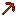</td>
</tr>
<tr>
<td align="center" style="border: 1px solid #555; width: 40px; height: 40px; padding: 4px;"></td>
<td align="center" style="border: 1px solid #555; width: 40px; height: 40px; padding: 4px;"></td>
<td align="center" style="border: 1px solid #555; width: 40px; height: 40px; padding: 4px;"></td>
</tr>
<tr>
<td align="center" style="border: 1px solid #555; width: 40px; height: 40px; padding: 4px;"></td>
<td align="center" style="border: 1px solid #555; width: 40px; height: 40px; padding: 4px;"></td>
<td align="center" style="border: 1px solid #555; width: 40px; height: 40px; padding: 4px;"></td>
</tr>
</table>

> **Crafting (Shaped):** 3 Ruby + 2 Sticks ➞ 1 Ruby Pickaxe

#### Ruby Axe

<table style="border-collapse: collapse;">
<tr>
<td align="center" style="border: 1px solid #555; width: 40px; height: 40px; padding: 4px;"></td>
<td align="center" style="border: 1px solid #555; width: 40px; height: 40px; padding: 4px;"></td>
<td align="center" style="border: 1px solid #555; width: 40px; height: 40px; padding: 4px;"></td>
<td rowspan="3" align="center" width="44" style="vertical-align: middle;">➞</td>
<td rowspan="3" align="center" style="vertical-align: middle; white-space: normal;">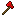</td>
</tr>
<tr>
<td align="center" style="border: 1px solid #555; width: 40px; height: 40px; padding: 4px;"></td>
<td align="center" style="border: 1px solid #555; width: 40px; height: 40px; padding: 4px;"></td>
<td align="center" style="border: 1px solid #555; width: 40px; height: 40px; padding: 4px;"></td>
</tr>
<tr>
<td align="center" style="border: 1px solid #555; width: 40px; height: 40px; padding: 4px;"></td>
<td align="center" style="border: 1px solid #555; width: 40px; height: 40px; padding: 4px;"></td>
<td align="center" style="border: 1px solid #555; width: 40px; height: 40px; padding: 4px;"></td>
</tr>
</table>

> **Crafting (Shaped):** 3 Ruby + 2 Sticks ➞ 1 Ruby Axe

#### Ruby Shovel

<table style="border-collapse: collapse;">
<tr>
<td align="center" style="border: 1px solid #555; width: 40px; height: 40px; padding: 4px;"></td>
<td align="center" style="border: 1px solid #555; width: 40px; height: 40px; padding: 4px;"></td>
<td align="center" style="border: 1px solid #555; width: 40px; height: 40px; padding: 4px;"></td>
<td rowspan="3" align="center" width="44" style="vertical-align: middle;">➞</td>
<td rowspan="3" align="center" style="vertical-align: middle; white-space: normal;"></td>
</tr>
<tr>
<td align="center" style="border: 1px solid #555; width: 40px; height: 40px; padding: 4px;"></td>
<td align="center" style="border: 1px solid #555; width: 40px; height: 40px; padding: 4px;"></td>
<td align="center" style="border: 1px solid #555; width: 40px; height: 40px; padding: 4px;"></td>
</tr>
<tr>
<td align="center" style="border: 1px solid #555; width: 40px; height: 40px; padding: 4px;"></td>
<td align="center" style="border: 1px solid #555; width: 40px; height: 40px; padding: 4px;"></td>
<td align="center" style="border: 1px solid #555; width: 40px; height: 40px; padding: 4px;"></td>
</tr>
</table>

> **Crafting (Shaped):** 1 Ruby + 2 Sticks ➞ 1 Ruby Shovel

#### Ruby Hoe

<table style="border-collapse: collapse;">
<tr>
<td align="center" style="border: 1px solid #555; width: 40px; height: 40px; padding: 4px;"></td>
<td align="center" style="border: 1px solid #555; width: 40px; height: 40px; padding: 4px;"></td>
<td align="center" style="border: 1px solid #555; width: 40px; height: 40px; padding: 4px;"></td>
<td rowspan="3" align="center" width="44" style="vertical-align: middle;">➞</td>
<td rowspan="3" align="center" style="vertical-align: middle; white-space: normal;">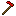</td>
</tr>
<tr>
<td align="center" style="border: 1px solid #555; width: 40px; height: 40px; padding: 4px;"></td>
<td align="center" style="border: 1px solid #555; width: 40px; height: 40px; padding: 4px;"></td>
<td align="center" style="border: 1px solid #555; width: 40px; height: 40px; padding: 4px;"></td>
</tr>
<tr>
<td align="center" style="border: 1px solid #555; width: 40px; height: 40px; padding: 4px;"></td>
<td align="center" style="border: 1px solid #555; width: 40px; height: 40px; padding: 4px;"></td>
<td align="center" style="border: 1px solid #555; width: 40px; height: 40px; padding: 4px;"></td>
</tr>
</table>

> **Crafting (Shaped):** 2 Ruby + 2 Sticks ➞ 1 Ruby Hoe

#### Ruby Helmet

<table style="border-collapse: collapse;">
<tr>
<td align="center" style="border: 1px solid #555; width: 40px; height: 40px; padding: 4px;"></td>
<td align="center" style="border: 1px solid #555; width: 40px; height: 40px; padding: 4px;"></td>
<td align="center" style="border: 1px solid #555; width: 40px; height: 40px; padding: 4px;"></td>
<td rowspan="3" align="center" width="44" style="vertical-align: middle;">➞</td>
<td rowspan="3" align="center" style="vertical-align: middle; white-space: normal;"></td>
</tr>
<tr>
<td align="center" style="border: 1px solid #555; width: 40px; height: 40px; padding: 4px;"></td>
<td align="center" style="border: 1px solid #555; width: 40px; height: 40px; padding: 4px;"></td>
<td align="center" style="border: 1px solid #555; width: 40px; height: 40px; padding: 4px;"></td>
</tr>
<tr>
<td align="center" style="border: 1px solid #555; width: 40px; height: 40px; padding: 4px;"></td>
<td align="center" style="border: 1px solid #555; width: 40px; height: 40px; padding: 4px;"></td>
<td align="center" style="border: 1px solid #555; width: 40px; height: 40px; padding: 4px;"></td>
</tr>
</table>

> **Crafting (Shaped):** 5 Ruby ➞ 1 Ruby Helmet

#### Ruby Chestplate

<table style="border-collapse: collapse;">
<tr>
<td align="center" style="border: 1px solid #555; width: 40px; height: 40px; padding: 4px;"></td>
<td align="center" style="border: 1px solid #555; width: 40px; height: 40px; padding: 4px;"></td>
<td align="center" style="border: 1px solid #555; width: 40px; height: 40px; padding: 4px;"></td>
<td rowspan="3" align="center" width="44" style="vertical-align: middle;">➞</td>
<td rowspan="3" align="center" style="vertical-align: middle; white-space: normal;"></td>
</tr>
<tr>
<td align="center" style="border: 1px solid #555; width: 40px; height: 40px; padding: 4px;"></td>
<td align="center" style="border: 1px solid #555; width: 40px; height: 40px; padding: 4px;"></td>
<td align="center" style="border: 1px solid #555; width: 40px; height: 40px; padding: 4px;"></td>
</tr>
<tr>
<td align="center" style="border: 1px solid #555; width: 40px; height: 40px; padding: 4px;"></td>
<td align="center" style="border: 1px solid #555; width: 40px; height: 40px; padding: 4px;"></td>
<td align="center" style="border: 1px solid #555; width: 40px; height: 40px; padding: 4px;"></td>
</tr>
</table>

> **Crafting (Shaped):** 8 Ruby ➞ 1 Ruby Chestplate

#### Ruby Leggings

<table style="border-collapse: collapse;">
<tr>
<td align="center" style="border: 1px solid #555; width: 40px; height: 40px; padding: 4px;"></td>
<td align="center" style="border: 1px solid #555; width: 40px; height: 40px; padding: 4px;"></td>
<td align="center" style="border: 1px solid #555; width: 40px; height: 40px; padding: 4px;"></td>
<td rowspan="3" align="center" width="44" style="vertical-align: middle;">➞</td>
<td rowspan="3" align="center" style="vertical-align: middle; white-space: normal;"></td>
</tr>
<tr>
<td align="center" style="border: 1px solid #555; width: 40px; height: 40px; padding: 4px;"></td>
<td align="center" style="border: 1px solid #555; width: 40px; height: 40px; padding: 4px;"></td>
<td align="center" style="border: 1px solid #555; width: 40px; height: 40px; padding: 4px;"></td>
</tr>
<tr>
<td align="center" style="border: 1px solid #555; width: 40px; height: 40px; padding: 4px;"></td>
<td align="center" style="border: 1px solid #555; width: 40px; height: 40px; padding: 4px;"></td>
<td align="center" style="border: 1px solid #555; width: 40px; height: 40px; padding: 4px;"></td>
</tr>
</table>

> **Crafting (Shaped):** 7 Ruby ➞ 1 Ruby Leggings

#### Ruby Boots

<table style="border-collapse: collapse;">
<tr>
<td align="center" style="border: 1px solid #555; width: 40px; height: 40px; padding: 4px;"></td>
<td align="center" style="border: 1px solid #555; width: 40px; height: 40px; padding: 4px;"></td>
<td align="center" style="border: 1px solid #555; width: 40px; height: 40px; padding: 4px;"></td>
<td rowspan="3" align="center" width="44" style="vertical-align: middle;">➞</td>
<td rowspan="3" align="center" style="vertical-align: middle; white-space: normal;"></td>
</tr>
<tr>
<td align="center" style="border: 1px solid #555; width: 40px; height: 40px; padding: 4px;"></td>
<td align="center" style="border: 1px solid #555; width: 40px; height: 40px; padding: 4px;"></td>
<td align="center" style="border: 1px solid #555; width: 40px; height: 40px; padding: 4px;"></td>
</tr>
<tr>
<td align="center" style="border: 1px solid #555; width: 40px; height: 40px; padding: 4px;"></td>
<td align="center" style="border: 1px solid #555; width: 40px; height: 40px; padding: 4px;"></td>
<td align="center" style="border: 1px solid #555; width: 40px; height: 40px; padding: 4px;"></td>
</tr>
</table>

> **Crafting (Shaped):** 4 Ruby ➞ 1 Ruby Boots

#### Block of Ruby

<table style="border-collapse: collapse;">
<tr>
<td align="center" style="border: 1px solid #555; width: 40px; height: 40px; padding: 4px;"></td>
<td align="center" style="border: 1px solid #555; width: 40px; height: 40px; padding: 4px;"></td>
<td align="center" style="border: 1px solid #555; width: 40px; height: 40px; padding: 4px;"></td>
<td rowspan="3" align="center" width="44" style="vertical-align: middle;">➞</td>
<td rowspan="3" align="center" style="vertical-align: middle; white-space: normal;"></td>
</tr>
<tr>
<td align="center" style="border: 1px solid #555; width: 40px; height: 40px; padding: 4px;"></td>
<td align="center" style="border: 1px solid #555; width: 40px; height: 40px; padding: 4px;"></td>
<td align="center" style="border: 1px solid #555; width: 40px; height: 40px; padding: 4px;"></td>
</tr>
<tr>
<td align="center" style="border: 1px solid #555; width: 40px; height: 40px; padding: 4px;"></td>
<td align="center" style="border: 1px solid #555; width: 40px; height: 40px; padding: 4px;"></td>
<td align="center" style="border: 1px solid #555; width: 40px; height: 40px; padding: 4px;"></td>
</tr>
</table>

> **Crafting (Shaped):** 9 Ruby ➞ 1 Block of Ruby

#### Ruby from Block

<table style="border-collapse: collapse;">
<tr>
<td align="center" style="border: 1px solid #555; width: 40px; height: 40px; padding: 4px;"></td>
<td align="center" width="44" style="vertical-align: middle;">➞</td>
<td align="center" style="vertical-align: middle; white-space: normal;"></td>
</tr>
</table>

> **Crafting (Shapeless):** 1 Block of Ruby ➞ 9 Ruby

#### Ruby Torch

<table style="border-collapse: collapse;">
<tr>
<td align="center" style="border: 1px solid #555; width: 40px; height: 40px; padding: 4px;"></td>
<td align="center" style="border: 1px solid #555; width: 40px; height: 40px; padding: 4px;"></td>
<td align="center" style="border: 1px solid #555; width: 40px; height: 40px; padding: 4px;"></td>
<td rowspan="3" align="center" width="44" style="vertical-align: middle;">➞</td>
<td rowspan="3" align="center" style="vertical-align: middle; white-space: normal;"></td>
</tr>
<tr>
<td align="center" style="border: 1px solid #555; width: 40px; height: 40px; padding: 4px;"></td>
<td align="center" style="border: 1px solid #555; width: 40px; height: 40px; padding: 4px;"></td>
<td align="center" style="border: 1px solid #555; width: 40px; height: 40px; padding: 4px;"></td>
</tr>
<tr>
<td align="center" style="border: 1px solid #555; width: 40px; height: 40px; padding: 4px;"></td>
<td align="center" style="border: 1px solid #555; width: 40px; height: 40px; padding: 4px;"></td>
<td align="center" style="border: 1px solid #555; width: 40px; height: 40px; padding: 4px;"></td>
</tr>
</table>

> **Crafting (Shaped):** Ruby above Coal above Stick ➞ 8 Ruby Torches

---

### Sapphire Recipes

#### Sapphire Sword

<table style="border-collapse: collapse;">
<tr>
<td align="center" style="border: 1px solid #555; width: 40px; height: 40px; padding: 4px;"></td>
<td align="center" style="border: 1px solid #555; width: 40px; height: 40px; padding: 4px;"></td>
<td align="center" style="border: 1px solid #555; width: 40px; height: 40px; padding: 4px;"></td>
<td rowspan="3" align="center" width="44" style="vertical-align: middle;">➞</td>
<td rowspan="3" align="center" style="vertical-align: middle; white-space: normal;"></td>
</tr>
<tr>
<td align="center" style="border: 1px solid #555; width: 40px; height: 40px; padding: 4px;"></td>
<td align="center" style="border: 1px solid #555; width: 40px; height: 40px; padding: 4px;"></td>
<td align="center" style="border: 1px solid #555; width: 40px; height: 40px; padding: 4px;"></td>
</tr>
<tr>
<td align="center" style="border: 1px solid #555; width: 40px; height: 40px; padding: 4px;"></td>
<td align="center" style="border: 1px solid #555; width: 40px; height: 40px; padding: 4px;"></td>
<td align="center" style="border: 1px solid #555; width: 40px; height: 40px; padding: 4px;"></td>
</tr>
</table>

> **Crafting (Shaped):** 2 Sapphire + 1 Stick ➞ 1 Sapphire Sword

#### Sapphire Pickaxe

<table style="border-collapse: collapse;">
<tr>
<td align="center" style="border: 1px solid #555; width: 40px; height: 40px; padding: 4px;"></td>
<td align="center" style="border: 1px solid #555; width: 40px; height: 40px; padding: 4px;"></td>
<td align="center" style="border: 1px solid #555; width: 40px; height: 40px; padding: 4px;"></td>
<td rowspan="3" align="center" width="44" style="vertical-align: middle;">➞</td>
<td rowspan="3" align="center" style="vertical-align: middle; white-space: normal;">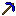</td>
</tr>
<tr>
<td align="center" style="border: 1px solid #555; width: 40px; height: 40px; padding: 4px;"></td>
<td align="center" style="border: 1px solid #555; width: 40px; height: 40px; padding: 4px;"></td>
<td align="center" style="border: 1px solid #555; width: 40px; height: 40px; padding: 4px;"></td>
</tr>
<tr>
<td align="center" style="border: 1px solid #555; width: 40px; height: 40px; padding: 4px;"></td>
<td align="center" style="border: 1px solid #555; width: 40px; height: 40px; padding: 4px;"></td>
<td align="center" style="border: 1px solid #555; width: 40px; height: 40px; padding: 4px;"></td>
</tr>
</table>

> **Crafting (Shaped):** 3 Sapphire + 2 Sticks ➞ 1 Sapphire Pickaxe

#### Sapphire Axe

<table style="border-collapse: collapse;">
<tr>
<td align="center" style="border: 1px solid #555; width: 40px; height: 40px; padding: 4px;"></td>
<td align="center" style="border: 1px solid #555; width: 40px; height: 40px; padding: 4px;"></td>
<td align="center" style="border: 1px solid #555; width: 40px; height: 40px; padding: 4px;"></td>
<td rowspan="3" align="center" width="44" style="vertical-align: middle;">➞</td>
<td rowspan="3" align="center" style="vertical-align: middle; white-space: normal;">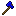</td>
</tr>
<tr>
<td align="center" style="border: 1px solid #555; width: 40px; height: 40px; padding: 4px;"></td>
<td align="center" style="border: 1px solid #555; width: 40px; height: 40px; padding: 4px;"></td>
<td align="center" style="border: 1px solid #555; width: 40px; height: 40px; padding: 4px;"></td>
</tr>
<tr>
<td align="center" style="border: 1px solid #555; width: 40px; height: 40px; padding: 4px;"></td>
<td align="center" style="border: 1px solid #555; width: 40px; height: 40px; padding: 4px;"></td>
<td align="center" style="border: 1px solid #555; width: 40px; height: 40px; padding: 4px;"></td>
</tr>
</table>

> **Crafting (Shaped):** 3 Sapphire + 2 Sticks ➞ 1 Sapphire Axe

#### Sapphire Shovel

<table style="border-collapse: collapse;">
<tr>
<td align="center" style="border: 1px solid #555; width: 40px; height: 40px; padding: 4px;"></td>
<td align="center" style="border: 1px solid #555; width: 40px; height: 40px; padding: 4px;"></td>
<td align="center" style="border: 1px solid #555; width: 40px; height: 40px; padding: 4px;"></td>
<td rowspan="3" align="center" width="44" style="vertical-align: middle;">➞</td>
<td rowspan="3" align="center" style="vertical-align: middle; white-space: normal;">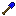</td>
</tr>
<tr>
<td align="center" style="border: 1px solid #555; width: 40px; height: 40px; padding: 4px;"></td>
<td align="center" style="border: 1px solid #555; width: 40px; height: 40px; padding: 4px;"></td>
<td align="center" style="border: 1px solid #555; width: 40px; height: 40px; padding: 4px;"></td>
</tr>
<tr>
<td align="center" style="border: 1px solid #555; width: 40px; height: 40px; padding: 4px;"></td>
<td align="center" style="border: 1px solid #555; width: 40px; height: 40px; padding: 4px;"></td>
<td align="center" style="border: 1px solid #555; width: 40px; height: 40px; padding: 4px;"></td>
</tr>
</table>

> **Crafting (Shaped):** 1 Sapphire + 2 Sticks ➞ 1 Sapphire Shovel

#### Sapphire Hoe

<table style="border-collapse: collapse;">
<tr>
<td align="center" style="border: 1px solid #555; width: 40px; height: 40px; padding: 4px;"></td>
<td align="center" style="border: 1px solid #555; width: 40px; height: 40px; padding: 4px;"></td>
<td align="center" style="border: 1px solid #555; width: 40px; height: 40px; padding: 4px;"></td>
<td rowspan="3" align="center" width="44" style="vertical-align: middle;">➞</td>
<td rowspan="3" align="center" style="vertical-align: middle; white-space: normal;">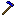</td>
</tr>
<tr>
<td align="center" style="border: 1px solid #555; width: 40px; height: 40px; padding: 4px;"></td>
<td align="center" style="border: 1px solid #555; width: 40px; height: 40px; padding: 4px;"></td>
<td align="center" style="border: 1px solid #555; width: 40px; height: 40px; padding: 4px;"></td>
</tr>
<tr>
<td align="center" style="border: 1px solid #555; width: 40px; height: 40px; padding: 4px;"></td>
<td align="center" style="border: 1px solid #555; width: 40px; height: 40px; padding: 4px;"></td>
<td align="center" style="border: 1px solid #555; width: 40px; height: 40px; padding: 4px;"></td>
</tr>
</table>

> **Crafting (Shaped):** 2 Sapphire + 2 Sticks ➞ 1 Sapphire Hoe

#### Sapphire Helmet

<table style="border-collapse: collapse;">
<tr>
<td align="center" style="border: 1px solid #555; width: 40px; height: 40px; padding: 4px;"></td>
<td align="center" style="border: 1px solid #555; width: 40px; height: 40px; padding: 4px;"></td>
<td align="center" style="border: 1px solid #555; width: 40px; height: 40px; padding: 4px;"></td>
<td rowspan="3" align="center" width="44" style="vertical-align: middle;">➞</td>
<td rowspan="3" align="center" style="vertical-align: middle; white-space: normal;"></td>
</tr>
<tr>
<td align="center" style="border: 1px solid #555; width: 40px; height: 40px; padding: 4px;"></td>
<td align="center" style="border: 1px solid #555; width: 40px; height: 40px; padding: 4px;"></td>
<td align="center" style="border: 1px solid #555; width: 40px; height: 40px; padding: 4px;"></td>
</tr>
<tr>
<td align="center" style="border: 1px solid #555; width: 40px; height: 40px; padding: 4px;"></td>
<td align="center" style="border: 1px solid #555; width: 40px; height: 40px; padding: 4px;"></td>
<td align="center" style="border: 1px solid #555; width: 40px; height: 40px; padding: 4px;"></td>
</tr>
</table>

> **Crafting (Shaped):** 5 Sapphire ➞ 1 Sapphire Helmet

#### Sapphire Chestplate

<table style="border-collapse: collapse;">
<tr>
<td align="center" style="border: 1px solid #555; width: 40px; height: 40px; padding: 4px;"></td>
<td align="center" style="border: 1px solid #555; width: 40px; height: 40px; padding: 4px;"></td>
<td align="center" style="border: 1px solid #555; width: 40px; height: 40px; padding: 4px;"></td>
<td rowspan="3" align="center" width="44" style="vertical-align: middle;">➞</td>
<td rowspan="3" align="center" style="vertical-align: middle; white-space: normal;"></td>
</tr>
<tr>
<td align="center" style="border: 1px solid #555; width: 40px; height: 40px; padding: 4px;"></td>
<td align="center" style="border: 1px solid #555; width: 40px; height: 40px; padding: 4px;"></td>
<td align="center" style="border: 1px solid #555; width: 40px; height: 40px; padding: 4px;"></td>
</tr>
<tr>
<td align="center" style="border: 1px solid #555; width: 40px; height: 40px; padding: 4px;"></td>
<td align="center" style="border: 1px solid #555; width: 40px; height: 40px; padding: 4px;"></td>
<td align="center" style="border: 1px solid #555; width: 40px; height: 40px; padding: 4px;"></td>
</tr>
</table>

> **Crafting (Shaped):** 8 Sapphire ➞ 1 Sapphire Chestplate

#### Sapphire Leggings

<table style="border-collapse: collapse;">
<tr>
<td align="center" style="border: 1px solid #555; width: 40px; height: 40px; padding: 4px;"></td>
<td align="center" style="border: 1px solid #555; width: 40px; height: 40px; padding: 4px;"></td>
<td align="center" style="border: 1px solid #555; width: 40px; height: 40px; padding: 4px;"></td>
<td rowspan="3" align="center" width="44" style="vertical-align: middle;">➞</td>
<td rowspan="3" align="center" style="vertical-align: middle; white-space: normal;"></td>
</tr>
<tr>
<td align="center" style="border: 1px solid #555; width: 40px; height: 40px; padding: 4px;"></td>
<td align="center" style="border: 1px solid #555; width: 40px; height: 40px; padding: 4px;"></td>
<td align="center" style="border: 1px solid #555; width: 40px; height: 40px; padding: 4px;"></td>
</tr>
<tr>
<td align="center" style="border: 1px solid #555; width: 40px; height: 40px; padding: 4px;"></td>
<td align="center" style="border: 1px solid #555; width: 40px; height: 40px; padding: 4px;"></td>
<td align="center" style="border: 1px solid #555; width: 40px; height: 40px; padding: 4px;"></td>
</tr>
</table>

> **Crafting (Shaped):** 7 Sapphire ➞ 1 Sapphire Leggings

#### Sapphire Boots

<table style="border-collapse: collapse;">
<tr>
<td align="center" style="border: 1px solid #555; width: 40px; height: 40px; padding: 4px;"></td>
<td align="center" style="border: 1px solid #555; width: 40px; height: 40px; padding: 4px;"></td>
<td align="center" style="border: 1px solid #555; width: 40px; height: 40px; padding: 4px;"></td>
<td rowspan="3" align="center" width="44" style="vertical-align: middle;">➞</td>
<td rowspan="3" align="center" style="vertical-align: middle; white-space: normal;"></td>
</tr>
<tr>
<td align="center" style="border: 1px solid #555; width: 40px; height: 40px; padding: 4px;"></td>
<td align="center" style="border: 1px solid #555; width: 40px; height: 40px; padding: 4px;"></td>
<td align="center" style="border: 1px solid #555; width: 40px; height: 40px; padding: 4px;"></td>
</tr>
<tr>
<td align="center" style="border: 1px solid #555; width: 40px; height: 40px; padding: 4px;"></td>
<td align="center" style="border: 1px solid #555; width: 40px; height: 40px; padding: 4px;"></td>
<td align="center" style="border: 1px solid #555; width: 40px; height: 40px; padding: 4px;"></td>
</tr>
</table>

> **Crafting (Shaped):** 4 Sapphire ➞ 1 Sapphire Boots

#### Block of Sapphire

<table style="border-collapse: collapse;">
<tr>
<td align="center" style="border: 1px solid #555; width: 40px; height: 40px; padding: 4px;"></td>
<td align="center" style="border: 1px solid #555; width: 40px; height: 40px; padding: 4px;"></td>
<td align="center" style="border: 1px solid #555; width: 40px; height: 40px; padding: 4px;"></td>
<td rowspan="3" align="center" width="44" style="vertical-align: middle;">➞</td>
<td rowspan="3" align="center" style="vertical-align: middle; white-space: normal;"></td>
</tr>
<tr>
<td align="center" style="border: 1px solid #555; width: 40px; height: 40px; padding: 4px;"></td>
<td align="center" style="border: 1px solid #555; width: 40px; height: 40px; padding: 4px;"></td>
<td align="center" style="border: 1px solid #555; width: 40px; height: 40px; padding: 4px;"></td>
</tr>
<tr>
<td align="center" style="border: 1px solid #555; width: 40px; height: 40px; padding: 4px;"></td>
<td align="center" style="border: 1px solid #555; width: 40px; height: 40px; padding: 4px;"></td>
<td align="center" style="border: 1px solid #555; width: 40px; height: 40px; padding: 4px;"></td>
</tr>
</table>

> **Crafting (Shaped):** 9 Sapphire ➞ 1 Block of Sapphire

#### Sapphire from Block

<table style="border-collapse: collapse;">
<tr>
<td align="center" style="border: 1px solid #555; width: 40px; height: 40px; padding: 4px;"></td>
<td align="center" width="44" style="vertical-align: middle;">➞</td>
<td align="center" style="vertical-align: middle; white-space: normal;"></td>
</tr>
</table>

> **Crafting (Shapeless):** 1 Block of Sapphire ➞ 9 Sapphire

#### Sapphire Torch

<table style="border-collapse: collapse;">
<tr>
<td align="center" style="border: 1px solid #555; width: 40px; height: 40px; padding: 4px;"></td>
<td align="center" style="border: 1px solid #555; width: 40px; height: 40px; padding: 4px;"></td>
<td align="center" style="border: 1px solid #555; width: 40px; height: 40px; padding: 4px;"></td>
<td rowspan="3" align="center" width="44" style="vertical-align: middle;">➞</td>
<td rowspan="3" align="center" style="vertical-align: middle; white-space: normal;"></td>
</tr>
<tr>
<td align="center" style="border: 1px solid #555; width: 40px; height: 40px; padding: 4px;"></td>
<td align="center" style="border: 1px solid #555; width: 40px; height: 40px; padding: 4px;"></td>
<td align="center" style="border: 1px solid #555; width: 40px; height: 40px; padding: 4px;"></td>
</tr>
<tr>
<td align="center" style="border: 1px solid #555; width: 40px; height: 40px; padding: 4px;"></td>
<td align="center" style="border: 1px solid #555; width: 40px; height: 40px; padding: 4px;"></td>
<td align="center" style="border: 1px solid #555; width: 40px; height: 40px; padding: 4px;"></td>
</tr>
</table>

> **Crafting (Shaped):** Sapphire above Coal above Stick ➞ 8 Sapphire Torches

---

### Tourmaline Recipes

#### Tourmaline Sword

<table style="border-collapse: collapse;">
<tr>
<td align="center" style="border: 1px solid #555; width: 40px; height: 40px; padding: 4px;"></td>
<td align="center" style="border: 1px solid #555; width: 40px; height: 40px; padding: 4px;"></td>
<td align="center" style="border: 1px solid #555; width: 40px; height: 40px; padding: 4px;"></td>
<td rowspan="3" align="center" width="44" style="vertical-align: middle;">➞</td>
<td rowspan="3" align="center" style="vertical-align: middle; white-space: normal;">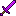</td>
</tr>
<tr>
<td align="center" style="border: 1px solid #555; width: 40px; height: 40px; padding: 4px;"></td>
<td align="center" style="border: 1px solid #555; width: 40px; height: 40px; padding: 4px;"></td>
<td align="center" style="border: 1px solid #555; width: 40px; height: 40px; padding: 4px;"></td>
</tr>
<tr>
<td align="center" style="border: 1px solid #555; width: 40px; height: 40px; padding: 4px;"></td>
<td align="center" style="border: 1px solid #555; width: 40px; height: 40px; padding: 4px;"></td>
<td align="center" style="border: 1px solid #555; width: 40px; height: 40px; padding: 4px;"></td>
</tr>
</table>

> **Crafting (Shaped):** 2 Tourmaline + 1 Stick ➞ 1 Tourmaline Sword

#### Tourmaline Pickaxe

<table style="border-collapse: collapse;">
<tr>
<td align="center" style="border: 1px solid #555; width: 40px; height: 40px; padding: 4px;"></td>
<td align="center" style="border: 1px solid #555; width: 40px; height: 40px; padding: 4px;"></td>
<td align="center" style="border: 1px solid #555; width: 40px; height: 40px; padding: 4px;"></td>
<td rowspan="3" align="center" width="44" style="vertical-align: middle;">➞</td>
<td rowspan="3" align="center" style="vertical-align: middle; white-space: normal;">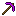</td>
</tr>
<tr>
<td align="center" style="border: 1px solid #555; width: 40px; height: 40px; padding: 4px;"></td>
<td align="center" style="border: 1px solid #555; width: 40px; height: 40px; padding: 4px;"></td>
<td align="center" style="border: 1px solid #555; width: 40px; height: 40px; padding: 4px;"></td>
</tr>
<tr>
<td align="center" style="border: 1px solid #555; width: 40px; height: 40px; padding: 4px;"></td>
<td align="center" style="border: 1px solid #555; width: 40px; height: 40px; padding: 4px;"></td>
<td align="center" style="border: 1px solid #555; width: 40px; height: 40px; padding: 4px;"></td>
</tr>
</table>

> **Crafting (Shaped):** 3 Tourmaline + 2 Sticks ➞ 1 Tourmaline Pickaxe

#### Tourmaline Axe

<table style="border-collapse: collapse;">
<tr>
<td align="center" style="border: 1px solid #555; width: 40px; height: 40px; padding: 4px;"></td>
<td align="center" style="border: 1px solid #555; width: 40px; height: 40px; padding: 4px;"></td>
<td align="center" style="border: 1px solid #555; width: 40px; height: 40px; padding: 4px;"></td>
<td rowspan="3" align="center" width="44" style="vertical-align: middle;">➞</td>
<td rowspan="3" align="center" style="vertical-align: middle; white-space: normal;">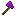</td>
</tr>
<tr>
<td align="center" style="border: 1px solid #555; width: 40px; height: 40px; padding: 4px;"></td>
<td align="center" style="border: 1px solid #555; width: 40px; height: 40px; padding: 4px;"></td>
<td align="center" style="border: 1px solid #555; width: 40px; height: 40px; padding: 4px;"></td>
</tr>
<tr>
<td align="center" style="border: 1px solid #555; width: 40px; height: 40px; padding: 4px;"></td>
<td align="center" style="border: 1px solid #555; width: 40px; height: 40px; padding: 4px;"></td>
<td align="center" style="border: 1px solid #555; width: 40px; height: 40px; padding: 4px;"></td>
</tr>
</table>

> **Crafting (Shaped):** 3 Tourmaline + 2 Sticks ➞ 1 Tourmaline Axe

#### Tourmaline Shovel

<table style="border-collapse: collapse;">
<tr>
<td align="center" style="border: 1px solid #555; width: 40px; height: 40px; padding: 4px;"></td>
<td align="center" style="border: 1px solid #555; width: 40px; height: 40px; padding: 4px;"></td>
<td align="center" style="border: 1px solid #555; width: 40px; height: 40px; padding: 4px;"></td>
<td rowspan="3" align="center" width="44" style="vertical-align: middle;">➞</td>
<td rowspan="3" align="center" style="vertical-align: middle; white-space: normal;">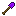</td>
</tr>
<tr>
<td align="center" style="border: 1px solid #555; width: 40px; height: 40px; padding: 4px;"></td>
<td align="center" style="border: 1px solid #555; width: 40px; height: 40px; padding: 4px;"></td>
<td align="center" style="border: 1px solid #555; width: 40px; height: 40px; padding: 4px;"></td>
</tr>
<tr>
<td align="center" style="border: 1px solid #555; width: 40px; height: 40px; padding: 4px;"></td>
<td align="center" style="border: 1px solid #555; width: 40px; height: 40px; padding: 4px;"></td>
<td align="center" style="border: 1px solid #555; width: 40px; height: 40px; padding: 4px;"></td>
</tr>
</table>

> **Crafting (Shaped):** 1 Tourmaline + 2 Sticks ➞ 1 Tourmaline Shovel

#### Tourmaline Hoe

<table style="border-collapse: collapse;">
<tr>
<td align="center" style="border: 1px solid #555; width: 40px; height: 40px; padding: 4px;"></td>
<td align="center" style="border: 1px solid #555; width: 40px; height: 40px; padding: 4px;"></td>
<td align="center" style="border: 1px solid #555; width: 40px; height: 40px; padding: 4px;"></td>
<td rowspan="3" align="center" width="44" style="vertical-align: middle;">➞</td>
<td rowspan="3" align="center" style="vertical-align: middle; white-space: normal;">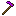</td>
</tr>
<tr>
<td align="center" style="border: 1px solid #555; width: 40px; height: 40px; padding: 4px;"></td>
<td align="center" style="border: 1px solid #555; width: 40px; height: 40px; padding: 4px;"></td>
<td align="center" style="border: 1px solid #555; width: 40px; height: 40px; padding: 4px;"></td>
</tr>
<tr>
<td align="center" style="border: 1px solid #555; width: 40px; height: 40px; padding: 4px;"></td>
<td align="center" style="border: 1px solid #555; width: 40px; height: 40px; padding: 4px;"></td>
<td align="center" style="border: 1px solid #555; width: 40px; height: 40px; padding: 4px;"></td>
</tr>
</table>

> **Crafting (Shaped):** 2 Tourmaline + 2 Sticks ➞ 1 Tourmaline Hoe

#### Tourmaline Helmet

<table style="border-collapse: collapse;">
<tr>
<td align="center" style="border: 1px solid #555; width: 40px; height: 40px; padding: 4px;"></td>
<td align="center" style="border: 1px solid #555; width: 40px; height: 40px; padding: 4px;"></td>
<td align="center" style="border: 1px solid #555; width: 40px; height: 40px; padding: 4px;"></td>
<td rowspan="3" align="center" width="44" style="vertical-align: middle;">➞</td>
<td rowspan="3" align="center" style="vertical-align: middle; white-space: normal;"></td>
</tr>
<tr>
<td align="center" style="border: 1px solid #555; width: 40px; height: 40px; padding: 4px;"></td>
<td align="center" style="border: 1px solid #555; width: 40px; height: 40px; padding: 4px;"></td>
<td align="center" style="border: 1px solid #555; width: 40px; height: 40px; padding: 4px;"></td>
</tr>
<tr>
<td align="center" style="border: 1px solid #555; width: 40px; height: 40px; padding: 4px;"></td>
<td align="center" style="border: 1px solid #555; width: 40px; height: 40px; padding: 4px;"></td>
<td align="center" style="border: 1px solid #555; width: 40px; height: 40px; padding: 4px;"></td>
</tr>
</table>

> **Crafting (Shaped):** 5 Tourmaline ➞ 1 Tourmaline Helmet

#### Tourmaline Chestplate

<table style="border-collapse: collapse;">
<tr>
<td align="center" style="border: 1px solid #555; width: 40px; height: 40px; padding: 4px;"></td>
<td align="center" style="border: 1px solid #555; width: 40px; height: 40px; padding: 4px;"></td>
<td align="center" style="border: 1px solid #555; width: 40px; height: 40px; padding: 4px;"></td>
<td rowspan="3" align="center" width="44" style="vertical-align: middle;">➞</td>
<td rowspan="3" align="center" style="vertical-align: middle; white-space: normal;">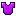</td>
</tr>
<tr>
<td align="center" style="border: 1px solid #555; width: 40px; height: 40px; padding: 4px;"></td>
<td align="center" style="border: 1px solid #555; width: 40px; height: 40px; padding: 4px;"></td>
<td align="center" style="border: 1px solid #555; width: 40px; height: 40px; padding: 4px;"></td>
</tr>
<tr>
<td align="center" style="border: 1px solid #555; width: 40px; height: 40px; padding: 4px;"></td>
<td align="center" style="border: 1px solid #555; width: 40px; height: 40px; padding: 4px;"></td>
<td align="center" style="border: 1px solid #555; width: 40px; height: 40px; padding: 4px;"></td>
</tr>
</table>

> **Crafting (Shaped):** 8 Tourmaline ➞ 1 Tourmaline Chestplate

#### Tourmaline Leggings

<table style="border-collapse: collapse;">
<tr>
<td align="center" style="border: 1px solid #555; width: 40px; height: 40px; padding: 4px;"></td>
<td align="center" style="border: 1px solid #555; width: 40px; height: 40px; padding: 4px;"></td>
<td align="center" style="border: 1px solid #555; width: 40px; height: 40px; padding: 4px;"></td>
<td rowspan="3" align="center" width="44" style="vertical-align: middle;">➞</td>
<td rowspan="3" align="center" style="vertical-align: middle; white-space: normal;"></td>
</tr>
<tr>
<td align="center" style="border: 1px solid #555; width: 40px; height: 40px; padding: 4px;"></td>
<td align="center" style="border: 1px solid #555; width: 40px; height: 40px; padding: 4px;"></td>
<td align="center" style="border: 1px solid #555; width: 40px; height: 40px; padding: 4px;"></td>
</tr>
<tr>
<td align="center" style="border: 1px solid #555; width: 40px; height: 40px; padding: 4px;"></td>
<td align="center" style="border: 1px solid #555; width: 40px; height: 40px; padding: 4px;"></td>
<td align="center" style="border: 1px solid #555; width: 40px; height: 40px; padding: 4px;"></td>
</tr>
</table>

> **Crafting (Shaped):** 7 Tourmaline ➞ 1 Tourmaline Leggings

#### Tourmaline Boots

<table style="border-collapse: collapse;">
<tr>
<td align="center" style="border: 1px solid #555; width: 40px; height: 40px; padding: 4px;"></td>
<td align="center" style="border: 1px solid #555; width: 40px; height: 40px; padding: 4px;"></td>
<td align="center" style="border: 1px solid #555; width: 40px; height: 40px; padding: 4px;"></td>
<td rowspan="3" align="center" width="44" style="vertical-align: middle;">➞</td>
<td rowspan="3" align="center" style="vertical-align: middle; white-space: normal;"></td>
</tr>
<tr>
<td align="center" style="border: 1px solid #555; width: 40px; height: 40px; padding: 4px;"></td>
<td align="center" style="border: 1px solid #555; width: 40px; height: 40px; padding: 4px;"></td>
<td align="center" style="border: 1px solid #555; width: 40px; height: 40px; padding: 4px;"></td>
</tr>
<tr>
<td align="center" style="border: 1px solid #555; width: 40px; height: 40px; padding: 4px;"></td>
<td align="center" style="border: 1px solid #555; width: 40px; height: 40px; padding: 4px;"></td>
<td align="center" style="border: 1px solid #555; width: 40px; height: 40px; padding: 4px;"></td>
</tr>
</table>

> **Crafting (Shaped):** 4 Tourmaline ➞ 1 Tourmaline Boots

#### Block of Tourmaline

<table style="border-collapse: collapse;">
<tr>
<td align="center" style="border: 1px solid #555; width: 40px; height: 40px; padding: 4px;"></td>
<td align="center" style="border: 1px solid #555; width: 40px; height: 40px; padding: 4px;"></td>
<td align="center" style="border: 1px solid #555; width: 40px; height: 40px; padding: 4px;"></td>
<td rowspan="3" align="center" width="44" style="vertical-align: middle;">➞</td>
<td rowspan="3" align="center" style="vertical-align: middle; white-space: normal;"></td>
</tr>
<tr>
<td align="center" style="border: 1px solid #555; width: 40px; height: 40px; padding: 4px;"></td>
<td align="center" style="border: 1px solid #555; width: 40px; height: 40px; padding: 4px;"></td>
<td align="center" style="border: 1px solid #555; width: 40px; height: 40px; padding: 4px;"></td>
</tr>
<tr>
<td align="center" style="border: 1px solid #555; width: 40px; height: 40px; padding: 4px;"></td>
<td align="center" style="border: 1px solid #555; width: 40px; height: 40px; padding: 4px;"></td>
<td align="center" style="border: 1px solid #555; width: 40px; height: 40px; padding: 4px;"></td>
</tr>
</table>

> **Crafting (Shaped):** 9 Tourmaline ➞ 1 Block of Tourmaline

#### Tourmaline from Block

<table style="border-collapse: collapse;">
<tr>
<td align="center" style="border: 1px solid #555; width: 40px; height: 40px; padding: 4px;"></td>
<td align="center" width="44" style="vertical-align: middle;">➞</td>
<td align="center" style="vertical-align: middle; white-space: normal;"></td>
</tr>
</table>

> **Crafting (Shapeless):** 1 Block of Tourmaline ➞ 9 Tourmaline

#### Tourmaline Torch

<table style="border-collapse: collapse;">
<tr>
<td align="center" style="border: 1px solid #555; width: 40px; height: 40px; padding: 4px;"></td>
<td align="center" style="border: 1px solid #555; width: 40px; height: 40px; padding: 4px;"></td>
<td align="center" style="border: 1px solid #555; width: 40px; height: 40px; padding: 4px;"></td>
<td rowspan="3" align="center" width="44" style="vertical-align: middle;">➞</td>
<td rowspan="3" align="center" style="vertical-align: middle; white-space: normal;"></td>
</tr>
<tr>
<td align="center" style="border: 1px solid #555; width: 40px; height: 40px; padding: 4px;"></td>
<td align="center" style="border: 1px solid #555; width: 40px; height: 40px; padding: 4px;"></td>
<td align="center" style="border: 1px solid #555; width: 40px; height: 40px; padding: 4px;"></td>
</tr>
<tr>
<td align="center" style="border: 1px solid #555; width: 40px; height: 40px; padding: 4px;"></td>
<td align="center" style="border: 1px solid #555; width: 40px; height: 40px; padding: 4px;"></td>
<td align="center" style="border: 1px solid #555; width: 40px; height: 40px; padding: 4px;"></td>
</tr>
</table>

> **Crafting (Shaped):** Tourmaline above Coal above Stick ➞ 8 Tourmaline Torches

---

### Chromium Recipes

#### Chromium Sword

<table style="border-collapse: collapse;">
<tr>
<td align="center" style="border: 1px solid #555; width: 40px; height: 40px; padding: 4px;"></td>
<td align="center" style="border: 1px solid #555; width: 40px; height: 40px; padding: 4px;"></td>
<td align="center" style="border: 1px solid #555; width: 40px; height: 40px; padding: 4px;"></td>
<td rowspan="3" align="center" width="44" style="vertical-align: middle;">➞</td>
<td rowspan="3" align="center" style="vertical-align: middle; white-space: normal;">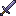</td>
</tr>
<tr>
<td align="center" style="border: 1px solid #555; width: 40px; height: 40px; padding: 4px;"></td>
<td align="center" style="border: 1px solid #555; width: 40px; height: 40px; padding: 4px;"></td>
<td align="center" style="border: 1px solid #555; width: 40px; height: 40px; padding: 4px;"></td>
</tr>
<tr>
<td align="center" style="border: 1px solid #555; width: 40px; height: 40px; padding: 4px;"></td>
<td align="center" style="border: 1px solid #555; width: 40px; height: 40px; padding: 4px;"></td>
<td align="center" style="border: 1px solid #555; width: 40px; height: 40px; padding: 4px;"></td>
</tr>
</table>

> **Crafting (Shaped):** 2 Chromium Ingot + 1 Stick ➞ 1 Chromium Sword

#### Chromium Pickaxe

<table style="border-collapse: collapse;">
<tr>
<td align="center" style="border: 1px solid #555; width: 40px; height: 40px; padding: 4px;"></td>
<td align="center" style="border: 1px solid #555; width: 40px; height: 40px; padding: 4px;"></td>
<td align="center" style="border: 1px solid #555; width: 40px; height: 40px; padding: 4px;"></td>
<td rowspan="3" align="center" width="44" style="vertical-align: middle;">➞</td>
<td rowspan="3" align="center" style="vertical-align: middle; white-space: normal;">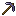</td>
</tr>
<tr>
<td align="center" style="border: 1px solid #555; width: 40px; height: 40px; padding: 4px;"></td>
<td align="center" style="border: 1px solid #555; width: 40px; height: 40px; padding: 4px;"></td>
<td align="center" style="border: 1px solid #555; width: 40px; height: 40px; padding: 4px;"></td>
</tr>
<tr>
<td align="center" style="border: 1px solid #555; width: 40px; height: 40px; padding: 4px;"></td>
<td align="center" style="border: 1px solid #555; width: 40px; height: 40px; padding: 4px;"></td>
<td align="center" style="border: 1px solid #555; width: 40px; height: 40px; padding: 4px;"></td>
</tr>
</table>

> **Crafting (Shaped):** 3 Chromium Ingot + 2 Sticks ➞ 1 Chromium Pickaxe

#### Chromium Axe

<table style="border-collapse: collapse;">
<tr>
<td align="center" style="border: 1px solid #555; width: 40px; height: 40px; padding: 4px;"></td>
<td align="center" style="border: 1px solid #555; width: 40px; height: 40px; padding: 4px;"></td>
<td align="center" style="border: 1px solid #555; width: 40px; height: 40px; padding: 4px;"></td>
<td rowspan="3" align="center" width="44" style="vertical-align: middle;">➞</td>
<td rowspan="3" align="center" style="vertical-align: middle; white-space: normal;">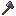</td>
</tr>
<tr>
<td align="center" style="border: 1px solid #555; width: 40px; height: 40px; padding: 4px;"></td>
<td align="center" style="border: 1px solid #555; width: 40px; height: 40px; padding: 4px;"></td>
<td align="center" style="border: 1px solid #555; width: 40px; height: 40px; padding: 4px;"></td>
</tr>
<tr>
<td align="center" style="border: 1px solid #555; width: 40px; height: 40px; padding: 4px;"></td>
<td align="center" style="border: 1px solid #555; width: 40px; height: 40px; padding: 4px;"></td>
<td align="center" style="border: 1px solid #555; width: 40px; height: 40px; padding: 4px;"></td>
</tr>
</table>

> **Crafting (Shaped):** 3 Chromium Ingot + 2 Sticks ➞ 1 Chromium Axe

#### Chromium Shovel

<table style="border-collapse: collapse;">
<tr>
<td align="center" style="border: 1px solid #555; width: 40px; height: 40px; padding: 4px;"></td>
<td align="center" style="border: 1px solid #555; width: 40px; height: 40px; padding: 4px;"></td>
<td align="center" style="border: 1px solid #555; width: 40px; height: 40px; padding: 4px;"></td>
<td rowspan="3" align="center" width="44" style="vertical-align: middle;">➞</td>
<td rowspan="3" align="center" style="vertical-align: middle; white-space: normal;">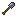</td>
</tr>
<tr>
<td align="center" style="border: 1px solid #555; width: 40px; height: 40px; padding: 4px;"></td>
<td align="center" style="border: 1px solid #555; width: 40px; height: 40px; padding: 4px;"></td>
<td align="center" style="border: 1px solid #555; width: 40px; height: 40px; padding: 4px;"></td>
</tr>
<tr>
<td align="center" style="border: 1px solid #555; width: 40px; height: 40px; padding: 4px;"></td>
<td align="center" style="border: 1px solid #555; width: 40px; height: 40px; padding: 4px;"></td>
<td align="center" style="border: 1px solid #555; width: 40px; height: 40px; padding: 4px;"></td>
</tr>
</table>

> **Crafting (Shaped):** 1 Chromium Ingot + 2 Sticks ➞ 1 Chromium Shovel

#### Chromium Hoe

<table style="border-collapse: collapse;">
<tr>
<td align="center" style="border: 1px solid #555; width: 40px; height: 40px; padding: 4px;"></td>
<td align="center" style="border: 1px solid #555; width: 40px; height: 40px; padding: 4px;"></td>
<td align="center" style="border: 1px solid #555; width: 40px; height: 40px; padding: 4px;"></td>
<td rowspan="3" align="center" width="44" style="vertical-align: middle;">➞</td>
<td rowspan="3" align="center" style="vertical-align: middle; white-space: normal;">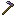</td>
</tr>
<tr>
<td align="center" style="border: 1px solid #555; width: 40px; height: 40px; padding: 4px;"></td>
<td align="center" style="border: 1px solid #555; width: 40px; height: 40px; padding: 4px;"></td>
<td align="center" style="border: 1px solid #555; width: 40px; height: 40px; padding: 4px;"></td>
</tr>
<tr>
<td align="center" style="border: 1px solid #555; width: 40px; height: 40px; padding: 4px;"></td>
<td align="center" style="border: 1px solid #555; width: 40px; height: 40px; padding: 4px;"></td>
<td align="center" style="border: 1px solid #555; width: 40px; height: 40px; padding: 4px;"></td>
</tr>
</table>

> **Crafting (Shaped):** 2 Chromium Ingot + 2 Sticks ➞ 1 Chromium Hoe

#### Chromium Helmet

<table style="border-collapse: collapse;">
<tr>
<td align="center" style="border: 1px solid #555; width: 40px; height: 40px; padding: 4px;"></td>
<td align="center" style="border: 1px solid #555; width: 40px; height: 40px; padding: 4px;"></td>
<td align="center" style="border: 1px solid #555; width: 40px; height: 40px; padding: 4px;"></td>
<td rowspan="3" align="center" width="44" style="vertical-align: middle;">➞</td>
<td rowspan="3" align="center" style="vertical-align: middle; white-space: normal;"></td>
</tr>
<tr>
<td align="center" style="border: 1px solid #555; width: 40px; height: 40px; padding: 4px;"></td>
<td align="center" style="border: 1px solid #555; width: 40px; height: 40px; padding: 4px;"></td>
<td align="center" style="border: 1px solid #555; width: 40px; height: 40px; padding: 4px;"></td>
</tr>
<tr>
<td align="center" style="border: 1px solid #555; width: 40px; height: 40px; padding: 4px;"></td>
<td align="center" style="border: 1px solid #555; width: 40px; height: 40px; padding: 4px;"></td>
<td align="center" style="border: 1px solid #555; width: 40px; height: 40px; padding: 4px;"></td>
</tr>
</table>

> **Crafting (Shaped):** 5 Chromium Ingot ➞ 1 Chromium Helmet

#### Chromium Chestplate

<table style="border-collapse: collapse;">
<tr>
<td align="center" style="border: 1px solid #555; width: 40px; height: 40px; padding: 4px;"></td>
<td align="center" style="border: 1px solid #555; width: 40px; height: 40px; padding: 4px;"></td>
<td align="center" style="border: 1px solid #555; width: 40px; height: 40px; padding: 4px;"></td>
<td rowspan="3" align="center" width="44" style="vertical-align: middle;">➞</td>
<td rowspan="3" align="center" style="vertical-align: middle; white-space: normal;"></td>
</tr>
<tr>
<td align="center" style="border: 1px solid #555; width: 40px; height: 40px; padding: 4px;"></td>
<td align="center" style="border: 1px solid #555; width: 40px; height: 40px; padding: 4px;"></td>
<td align="center" style="border: 1px solid #555; width: 40px; height: 40px; padding: 4px;"></td>
</tr>
<tr>
<td align="center" style="border: 1px solid #555; width: 40px; height: 40px; padding: 4px;"></td>
<td align="center" style="border: 1px solid #555; width: 40px; height: 40px; padding: 4px;"></td>
<td align="center" style="border: 1px solid #555; width: 40px; height: 40px; padding: 4px;"></td>
</tr>
</table>

> **Crafting (Shaped):** 8 Chromium Ingot ➞ 1 Chromium Chestplate

#### Chromium Leggings

<table style="border-collapse: collapse;">
<tr>
<td align="center" style="border: 1px solid #555; width: 40px; height: 40px; padding: 4px;"></td>
<td align="center" style="border: 1px solid #555; width: 40px; height: 40px; padding: 4px;"></td>
<td align="center" style="border: 1px solid #555; width: 40px; height: 40px; padding: 4px;"></td>
<td rowspan="3" align="center" width="44" style="vertical-align: middle;">➞</td>
<td rowspan="3" align="center" style="vertical-align: middle; white-space: normal;"></td>
</tr>
<tr>
<td align="center" style="border: 1px solid #555; width: 40px; height: 40px; padding: 4px;"></td>
<td align="center" style="border: 1px solid #555; width: 40px; height: 40px; padding: 4px;"></td>
<td align="center" style="border: 1px solid #555; width: 40px; height: 40px; padding: 4px;"></td>
</tr>
<tr>
<td align="center" style="border: 1px solid #555; width: 40px; height: 40px; padding: 4px;"></td>
<td align="center" style="border: 1px solid #555; width: 40px; height: 40px; padding: 4px;"></td>
<td align="center" style="border: 1px solid #555; width: 40px; height: 40px; padding: 4px;"></td>
</tr>
</table>

> **Crafting (Shaped):** 7 Chromium Ingot ➞ 1 Chromium Leggings

#### Chromium Boots

<table style="border-collapse: collapse;">
<tr>
<td align="center" style="border: 1px solid #555; width: 40px; height: 40px; padding: 4px;"></td>
<td align="center" style="border: 1px solid #555; width: 40px; height: 40px; padding: 4px;"></td>
<td align="center" style="border: 1px solid #555; width: 40px; height: 40px; padding: 4px;"></td>
<td rowspan="3" align="center" width="44" style="vertical-align: middle;">➞</td>
<td rowspan="3" align="center" style="vertical-align: middle; white-space: normal;"></td>
</tr>
<tr>
<td align="center" style="border: 1px solid #555; width: 40px; height: 40px; padding: 4px;"></td>
<td align="center" style="border: 1px solid #555; width: 40px; height: 40px; padding: 4px;"></td>
<td align="center" style="border: 1px solid #555; width: 40px; height: 40px; padding: 4px;"></td>
</tr>
<tr>
<td align="center" style="border: 1px solid #555; width: 40px; height: 40px; padding: 4px;"></td>
<td align="center" style="border: 1px solid #555; width: 40px; height: 40px; padding: 4px;"></td>
<td align="center" style="border: 1px solid #555; width: 40px; height: 40px; padding: 4px;"></td>
</tr>
</table>

> **Crafting (Shaped):** 4 Chromium Ingot ➞ 1 Chromium Boots

#### Block of Chromium

<table style="border-collapse: collapse;">
<tr>
<td align="center" style="border: 1px solid #555; width: 40px; height: 40px; padding: 4px;"></td>
<td align="center" style="border: 1px solid #555; width: 40px; height: 40px; padding: 4px;"></td>
<td align="center" style="border: 1px solid #555; width: 40px; height: 40px; padding: 4px;"></td>
<td rowspan="3" align="center" width="44" style="vertical-align: middle;">➞</td>
<td rowspan="3" align="center" style="vertical-align: middle; white-space: normal;"></td>
</tr>
<tr>
<td align="center" style="border: 1px solid #555; width: 40px; height: 40px; padding: 4px;"></td>
<td align="center" style="border: 1px solid #555; width: 40px; height: 40px; padding: 4px;"></td>
<td align="center" style="border: 1px solid #555; width: 40px; height: 40px; padding: 4px;"></td>
</tr>
<tr>
<td align="center" style="border: 1px solid #555; width: 40px; height: 40px; padding: 4px;"></td>
<td align="center" style="border: 1px solid #555; width: 40px; height: 40px; padding: 4px;"></td>
<td align="center" style="border: 1px solid #555; width: 40px; height: 40px; padding: 4px;"></td>
</tr>
</table>

> **Crafting (Shaped):** 9 Chromium Ingot ➞ 1 Block of Chromium

#### Chromium Ingot from Block

<table style="border-collapse: collapse;">
<tr>
<td align="center" style="border: 1px solid #555; width: 40px; height: 40px; padding: 4px;"></td>
<td align="center" width="44" style="vertical-align: middle;">➞</td>
<td align="center" style="vertical-align: middle; white-space: normal;"></td>
</tr>
</table>

> **Crafting (Shapeless):** 1 Block of Chromium ➞ 9 Chromium Ingot

#### Chromium Ingot from Nuggets

<table style="border-collapse: collapse;">
<tr>
<td align="center" style="border: 1px solid #555; width: 40px; height: 40px; padding: 4px;"></td>
<td align="center" style="border: 1px solid #555; width: 40px; height: 40px; padding: 4px;"></td>
<td align="center" style="border: 1px solid #555; width: 40px; height: 40px; padding: 4px;"></td>
<td rowspan="3" align="center" width="44" style="vertical-align: middle;">➞</td>
<td rowspan="3" align="center" style="vertical-align: middle; white-space: normal;"></td>
</tr>
<tr>
<td align="center" style="border: 1px solid #555; width: 40px; height: 40px; padding: 4px;"></td>
<td align="center" style="border: 1px solid #555; width: 40px; height: 40px; padding: 4px;"></td>
<td align="center" style="border: 1px solid #555; width: 40px; height: 40px; padding: 4px;"></td>
</tr>
<tr>
<td align="center" style="border: 1px solid #555; width: 40px; height: 40px; padding: 4px;"></td>
<td align="center" style="border: 1px solid #555; width: 40px; height: 40px; padding: 4px;"></td>
<td align="center" style="border: 1px solid #555; width: 40px; height: 40px; padding: 4px;"></td>
</tr>
</table>

> **Crafting (Shaped):** 9 Chromium Nuggets ➞ 1 Chromium Ingot

#### Chromium Nuggets from Ingot

<table style="border-collapse: collapse;">
<tr>
<td align="center" style="border: 1px solid #555; width: 40px; height: 40px; padding: 4px;"></td>
<td align="center" width="44" style="vertical-align: middle;">➞</td>
<td align="center" style="vertical-align: middle; white-space: normal;"></td>
</tr>
</table>

> **Crafting (Shapeless):** 1 Chromium Ingot ➞ 9 Chromium Nuggets

---

### Obsidian Recipes

#### Obsidian Sword

<table style="border-collapse: collapse;">
<tr>
<td align="center" style="border: 1px solid #555; width: 40px; height: 40px; padding: 4px;"></td>
<td align="center" style="border: 1px solid #555; width: 40px; height: 40px; padding: 4px;"></td>
<td align="center" style="border: 1px solid #555; width: 40px; height: 40px; padding: 4px;"></td>
<td rowspan="3" align="center" width="44" style="vertical-align: middle;">➞</td>
<td rowspan="3" align="center" style="vertical-align: middle; white-space: normal;"></td>
</tr>
<tr>
<td align="center" style="border: 1px solid #555; width: 40px; height: 40px; padding: 4px;"></td>
<td align="center" style="border: 1px solid #555; width: 40px; height: 40px; padding: 4px;"></td>
<td align="center" style="border: 1px solid #555; width: 40px; height: 40px; padding: 4px;"></td>
</tr>
<tr>
<td align="center" style="border: 1px solid #555; width: 40px; height: 40px; padding: 4px;"></td>
<td align="center" style="border: 1px solid #555; width: 40px; height: 40px; padding: 4px;"></td>
<td align="center" style="border: 1px solid #555; width: 40px; height: 40px; padding: 4px;"></td>
</tr>
</table>

> **Crafting (Shaped):** 2 Obsidian Shard + 1 Stick ➞ 1 Obsidian Sword

#### Obsidian Pickaxe

<table style="border-collapse: collapse;">
<tr>
<td align="center" style="border: 1px solid #555; width: 40px; height: 40px; padding: 4px;"></td>
<td align="center" style="border: 1px solid #555; width: 40px; height: 40px; padding: 4px;"></td>
<td align="center" style="border: 1px solid #555; width: 40px; height: 40px; padding: 4px;"></td>
<td rowspan="3" align="center" width="44" style="vertical-align: middle;">➞</td>
<td rowspan="3" align="center" style="vertical-align: middle; white-space: normal;">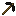</td>
</tr>
<tr>
<td align="center" style="border: 1px solid #555; width: 40px; height: 40px; padding: 4px;"></td>
<td align="center" style="border: 1px solid #555; width: 40px; height: 40px; padding: 4px;"></td>
<td align="center" style="border: 1px solid #555; width: 40px; height: 40px; padding: 4px;"></td>
</tr>
<tr>
<td align="center" style="border: 1px solid #555; width: 40px; height: 40px; padding: 4px;"></td>
<td align="center" style="border: 1px solid #555; width: 40px; height: 40px; padding: 4px;"></td>
<td align="center" style="border: 1px solid #555; width: 40px; height: 40px; padding: 4px;"></td>
</tr>
</table>

> **Crafting (Shaped):** 3 Obsidian Shard + 2 Sticks ➞ 1 Obsidian Pickaxe

#### Obsidian Axe

<table style="border-collapse: collapse;">
<tr>
<td align="center" style="border: 1px solid #555; width: 40px; height: 40px; padding: 4px;"></td>
<td align="center" style="border: 1px solid #555; width: 40px; height: 40px; padding: 4px;"></td>
<td align="center" style="border: 1px solid #555; width: 40px; height: 40px; padding: 4px;"></td>
<td rowspan="3" align="center" width="44" style="vertical-align: middle;">➞</td>
<td rowspan="3" align="center" style="vertical-align: middle; white-space: normal;"></td>
</tr>
<tr>
<td align="center" style="border: 1px solid #555; width: 40px; height: 40px; padding: 4px;"></td>
<td align="center" style="border: 1px solid #555; width: 40px; height: 40px; padding: 4px;"></td>
<td align="center" style="border: 1px solid #555; width: 40px; height: 40px; padding: 4px;"></td>
</tr>
<tr>
<td align="center" style="border: 1px solid #555; width: 40px; height: 40px; padding: 4px;"></td>
<td align="center" style="border: 1px solid #555; width: 40px; height: 40px; padding: 4px;"></td>
<td align="center" style="border: 1px solid #555; width: 40px; height: 40px; padding: 4px;"></td>
</tr>
</table>

> **Crafting (Shaped):** 3 Obsidian Shard + 2 Sticks ➞ 1 Obsidian Axe

#### Obsidian Shovel

<table style="border-collapse: collapse;">
<tr>
<td align="center" style="border: 1px solid #555; width: 40px; height: 40px; padding: 4px;"></td>
<td align="center" style="border: 1px solid #555; width: 40px; height: 40px; padding: 4px;"></td>
<td align="center" style="border: 1px solid #555; width: 40px; height: 40px; padding: 4px;"></td>
<td rowspan="3" align="center" width="44" style="vertical-align: middle;">➞</td>
<td rowspan="3" align="center" style="vertical-align: middle; white-space: normal;">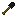</td>
</tr>
<tr>
<td align="center" style="border: 1px solid #555; width: 40px; height: 40px; padding: 4px;"></td>
<td align="center" style="border: 1px solid #555; width: 40px; height: 40px; padding: 4px;"></td>
<td align="center" style="border: 1px solid #555; width: 40px; height: 40px; padding: 4px;"></td>
</tr>
<tr>
<td align="center" style="border: 1px solid #555; width: 40px; height: 40px; padding: 4px;"></td>
<td align="center" style="border: 1px solid #555; width: 40px; height: 40px; padding: 4px;"></td>
<td align="center" style="border: 1px solid #555; width: 40px; height: 40px; padding: 4px;"></td>
</tr>
</table>

> **Crafting (Shaped):** 1 Obsidian Shard + 2 Sticks ➞ 1 Obsidian Shovel

#### Obsidian Hoe

<table style="border-collapse: collapse;">
<tr>
<td align="center" style="border: 1px solid #555; width: 40px; height: 40px; padding: 4px;"></td>
<td align="center" style="border: 1px solid #555; width: 40px; height: 40px; padding: 4px;"></td>
<td align="center" style="border: 1px solid #555; width: 40px; height: 40px; padding: 4px;"></td>
<td rowspan="3" align="center" width="44" style="vertical-align: middle;">➞</td>
<td rowspan="3" align="center" style="vertical-align: middle; white-space: normal;">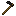</td>
</tr>
<tr>
<td align="center" style="border: 1px solid #555; width: 40px; height: 40px; padding: 4px;"></td>
<td align="center" style="border: 1px solid #555; width: 40px; height: 40px; padding: 4px;"></td>
<td align="center" style="border: 1px solid #555; width: 40px; height: 40px; padding: 4px;"></td>
</tr>
<tr>
<td align="center" style="border: 1px solid #555; width: 40px; height: 40px; padding: 4px;"></td>
<td align="center" style="border: 1px solid #555; width: 40px; height: 40px; padding: 4px;"></td>
<td align="center" style="border: 1px solid #555; width: 40px; height: 40px; padding: 4px;"></td>
</tr>
</table>

> **Crafting (Shaped):** 2 Obsidian Shard + 2 Sticks ➞ 1 Obsidian Hoe

#### Obsidian Helmet

<table style="border-collapse: collapse;">
<tr>
<td align="center" style="border: 1px solid #555; width: 40px; height: 40px; padding: 4px;"></td>
<td align="center" style="border: 1px solid #555; width: 40px; height: 40px; padding: 4px;"></td>
<td align="center" style="border: 1px solid #555; width: 40px; height: 40px; padding: 4px;"></td>
<td rowspan="3" align="center" width="44" style="vertical-align: middle;">➞</td>
<td rowspan="3" align="center" style="vertical-align: middle; white-space: normal;"></td>
</tr>
<tr>
<td align="center" style="border: 1px solid #555; width: 40px; height: 40px; padding: 4px;"></td>
<td align="center" style="border: 1px solid #555; width: 40px; height: 40px; padding: 4px;"></td>
<td align="center" style="border: 1px solid #555; width: 40px; height: 40px; padding: 4px;"></td>
</tr>
<tr>
<td align="center" style="border: 1px solid #555; width: 40px; height: 40px; padding: 4px;"></td>
<td align="center" style="border: 1px solid #555; width: 40px; height: 40px; padding: 4px;"></td>
<td align="center" style="border: 1px solid #555; width: 40px; height: 40px; padding: 4px;"></td>
</tr>
</table>

> **Crafting (Shaped):** 5 Obsidian Shard ➞ 1 Obsidian Helmet

#### Obsidian Chestplate

<table style="border-collapse: collapse;">
<tr>
<td align="center" style="border: 1px solid #555; width: 40px; height: 40px; padding: 4px;"></td>
<td align="center" style="border: 1px solid #555; width: 40px; height: 40px; padding: 4px;"></td>
<td align="center" style="border: 1px solid #555; width: 40px; height: 40px; padding: 4px;"></td>
<td rowspan="3" align="center" width="44" style="vertical-align: middle;">➞</td>
<td rowspan="3" align="center" style="vertical-align: middle; white-space: normal;"></td>
</tr>
<tr>
<td align="center" style="border: 1px solid #555; width: 40px; height: 40px; padding: 4px;"></td>
<td align="center" style="border: 1px solid #555; width: 40px; height: 40px; padding: 4px;"></td>
<td align="center" style="border: 1px solid #555; width: 40px; height: 40px; padding: 4px;"></td>
</tr>
<tr>
<td align="center" style="border: 1px solid #555; width: 40px; height: 40px; padding: 4px;"></td>
<td align="center" style="border: 1px solid #555; width: 40px; height: 40px; padding: 4px;"></td>
<td align="center" style="border: 1px solid #555; width: 40px; height: 40px; padding: 4px;"></td>
</tr>
</table>

> **Crafting (Shaped):** 8 Obsidian Shard ➞ 1 Obsidian Chestplate

#### Obsidian Leggings

<table style="border-collapse: collapse;">
<tr>
<td align="center" style="border: 1px solid #555; width: 40px; height: 40px; padding: 4px;"></td>
<td align="center" style="border: 1px solid #555; width: 40px; height: 40px; padding: 4px;"></td>
<td align="center" style="border: 1px solid #555; width: 40px; height: 40px; padding: 4px;"></td>
<td rowspan="3" align="center" width="44" style="vertical-align: middle;">➞</td>
<td rowspan="3" align="center" style="vertical-align: middle; white-space: normal;"></td>
</tr>
<tr>
<td align="center" style="border: 1px solid #555; width: 40px; height: 40px; padding: 4px;"></td>
<td align="center" style="border: 1px solid #555; width: 40px; height: 40px; padding: 4px;"></td>
<td align="center" style="border: 1px solid #555; width: 40px; height: 40px; padding: 4px;"></td>
</tr>
<tr>
<td align="center" style="border: 1px solid #555; width: 40px; height: 40px; padding: 4px;"></td>
<td align="center" style="border: 1px solid #555; width: 40px; height: 40px; padding: 4px;"></td>
<td align="center" style="border: 1px solid #555; width: 40px; height: 40px; padding: 4px;"></td>
</tr>
</table>

> **Crafting (Shaped):** 7 Obsidian Shard ➞ 1 Obsidian Leggings

#### Obsidian Boots

<table style="border-collapse: collapse;">
<tr>
<td align="center" style="border: 1px solid #555; width: 40px; height: 40px; padding: 4px;"></td>
<td align="center" style="border: 1px solid #555; width: 40px; height: 40px; padding: 4px;"></td>
<td align="center" style="border: 1px solid #555; width: 40px; height: 40px; padding: 4px;"></td>
<td rowspan="3" align="center" width="44" style="vertical-align: middle;">➞</td>
<td rowspan="3" align="center" style="vertical-align: middle; white-space: normal;"></td>
</tr>
<tr>
<td align="center" style="border: 1px solid #555; width: 40px; height: 40px; padding: 4px;"></td>
<td align="center" style="border: 1px solid #555; width: 40px; height: 40px; padding: 4px;"></td>
<td align="center" style="border: 1px solid #555; width: 40px; height: 40px; padding: 4px;"></td>
</tr>
<tr>
<td align="center" style="border: 1px solid #555; width: 40px; height: 40px; padding: 4px;"></td>
<td align="center" style="border: 1px solid #555; width: 40px; height: 40px; padding: 4px;"></td>
<td align="center" style="border: 1px solid #555; width: 40px; height: 40px; padding: 4px;"></td>
</tr>
</table>

> **Crafting (Shaped):** 4 Obsidian Shard ➞ 1 Obsidian Boots

#### Block of Obsidian

<table style="border-collapse: collapse;">
<tr>
<td align="center" style="border: 1px solid #555; width: 40px; height: 40px; padding: 4px;"></td>
<td align="center" style="border: 1px solid #555; width: 40px; height: 40px; padding: 4px;"></td>
<td align="center" style="border: 1px solid #555; width: 40px; height: 40px; padding: 4px;"></td>
<td rowspan="3" align="center" width="44" style="vertical-align: middle;">➞</td>
<td rowspan="3" align="center" style="vertical-align: middle; white-space: normal;"></td>
</tr>
<tr>
<td align="center" style="border: 1px solid #555; width: 40px; height: 40px; padding: 4px;"></td>
<td align="center" style="border: 1px solid #555; width: 40px; height: 40px; padding: 4px;"></td>
<td align="center" style="border: 1px solid #555; width: 40px; height: 40px; padding: 4px;"></td>
</tr>
<tr>
<td align="center" style="border: 1px solid #555; width: 40px; height: 40px; padding: 4px;"></td>
<td align="center" style="border: 1px solid #555; width: 40px; height: 40px; padding: 4px;"></td>
<td align="center" style="border: 1px solid #555; width: 40px; height: 40px; padding: 4px;"></td>
</tr>
</table>

> **Crafting (Shaped):** 9 Obsidian Shard ➞ 1 Block of Obsidian

#### Obsidian Shard from Block

<table style="border-collapse: collapse;">
<tr>
<td align="center" style="border: 1px solid #555; width: 40px; height: 40px; padding: 4px;"></td>
<td align="center" width="44" style="vertical-align: middle;">➞</td>
<td align="center" style="vertical-align: middle; white-space: normal;"></td>
</tr>
</table>

> **Crafting (Shapeless):** 1 Block of Obsidian ➞ 9 Obsidian Shard

#### Obsidian Torch

<table style="border-collapse: collapse;">
<tr>
<td align="center" style="border: 1px solid #555; width: 40px; height: 40px; padding: 4px;"></td>
<td align="center" style="border: 1px solid #555; width: 40px; height: 40px; padding: 4px;"></td>
<td align="center" style="border: 1px solid #555; width: 40px; height: 40px; padding: 4px;"></td>
<td rowspan="3" align="center" width="44" style="vertical-align: middle;">➞</td>
<td rowspan="3" align="center" style="vertical-align: middle; white-space: normal;"></td>
</tr>
<tr>
<td align="center" style="border: 1px solid #555; width: 40px; height: 40px; padding: 4px;"></td>
<td align="center" style="border: 1px solid #555; width: 40px; height: 40px; padding: 4px;"></td>
<td align="center" style="border: 1px solid #555; width: 40px; height: 40px; padding: 4px;"></td>
</tr>
<tr>
<td align="center" style="border: 1px solid #555; width: 40px; height: 40px; padding: 4px;"></td>
<td align="center" style="border: 1px solid #555; width: 40px; height: 40px; padding: 4px;"></td>
<td align="center" style="border: 1px solid #555; width: 40px; height: 40px; padding: 4px;"></td>
</tr>
</table>

> **Crafting (Shaped):** Obsidian Shard above Coal above Stick ➞ 8 Obsidian Torches

---

### Burning Diamond Recipes

#### Burning Diamond Sword

<table style="border-collapse: collapse;">
<tr>
<td align="center" style="border: 1px solid #555; width: 40px; height: 40px; padding: 4px;"></td>
<td align="center" style="border: 1px solid #555; width: 40px; height: 40px; padding: 4px;"></td>
<td align="center" style="border: 1px solid #555; width: 40px; height: 40px; padding: 4px;"></td>
<td rowspan="3" align="center" width="44" style="vertical-align: middle;">➞</td>
<td rowspan="3" align="center" style="vertical-align: middle; white-space: normal;">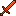</td>
</tr>
<tr>
<td align="center" style="border: 1px solid #555; width: 40px; height: 40px; padding: 4px;"></td>
<td align="center" style="border: 1px solid #555; width: 40px; height: 40px; padding: 4px;"></td>
<td align="center" style="border: 1px solid #555; width: 40px; height: 40px; padding: 4px;"></td>
</tr>
<tr>
<td align="center" style="border: 1px solid #555; width: 40px; height: 40px; padding: 4px;"></td>
<td align="center" style="border: 1px solid #555; width: 40px; height: 40px; padding: 4px;"></td>
<td align="center" style="border: 1px solid #555; width: 40px; height: 40px; padding: 4px;"></td>
</tr>
</table>

> **Crafting (Shaped):** 2 Burning Diamond + 1 Stick ➞ 1 Burning Diamond Sword

#### Burning Diamond Pickaxe

<table style="border-collapse: collapse;">
<tr>
<td align="center" style="border: 1px solid #555; width: 40px; height: 40px; padding: 4px;"></td>
<td align="center" style="border: 1px solid #555; width: 40px; height: 40px; padding: 4px;"></td>
<td align="center" style="border: 1px solid #555; width: 40px; height: 40px; padding: 4px;"></td>
<td rowspan="3" align="center" width="44" style="vertical-align: middle;">➞</td>
<td rowspan="3" align="center" style="vertical-align: middle; white-space: normal;">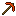</td>
</tr>
<tr>
<td align="center" style="border: 1px solid #555; width: 40px; height: 40px; padding: 4px;"></td>
<td align="center" style="border: 1px solid #555; width: 40px; height: 40px; padding: 4px;"></td>
<td align="center" style="border: 1px solid #555; width: 40px; height: 40px; padding: 4px;"></td>
</tr>
<tr>
<td align="center" style="border: 1px solid #555; width: 40px; height: 40px; padding: 4px;"></td>
<td align="center" style="border: 1px solid #555; width: 40px; height: 40px; padding: 4px;"></td>
<td align="center" style="border: 1px solid #555; width: 40px; height: 40px; padding: 4px;"></td>
</tr>
</table>

> **Crafting (Shaped):** 3 Burning Diamond + 2 Sticks ➞ 1 Burning Diamond Pickaxe

#### Burning Diamond Axe

<table style="border-collapse: collapse;">
<tr>
<td align="center" style="border: 1px solid #555; width: 40px; height: 40px; padding: 4px;"></td>
<td align="center" style="border: 1px solid #555; width: 40px; height: 40px; padding: 4px;"></td>
<td align="center" style="border: 1px solid #555; width: 40px; height: 40px; padding: 4px;"></td>
<td rowspan="3" align="center" width="44" style="vertical-align: middle;">➞</td>
<td rowspan="3" align="center" style="vertical-align: middle; white-space: normal;">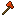</td>
</tr>
<tr>
<td align="center" style="border: 1px solid #555; width: 40px; height: 40px; padding: 4px;"></td>
<td align="center" style="border: 1px solid #555; width: 40px; height: 40px; padding: 4px;"></td>
<td align="center" style="border: 1px solid #555; width: 40px; height: 40px; padding: 4px;"></td>
</tr>
<tr>
<td align="center" style="border: 1px solid #555; width: 40px; height: 40px; padding: 4px;"></td>
<td align="center" style="border: 1px solid #555; width: 40px; height: 40px; padding: 4px;"></td>
<td align="center" style="border: 1px solid #555; width: 40px; height: 40px; padding: 4px;"></td>
</tr>
</table>

> **Crafting (Shaped):** 3 Burning Diamond + 2 Sticks ➞ 1 Burning Diamond Axe

#### Burning Diamond Shovel

<table style="border-collapse: collapse;">
<tr>
<td align="center" style="border: 1px solid #555; width: 40px; height: 40px; padding: 4px;"></td>
<td align="center" style="border: 1px solid #555; width: 40px; height: 40px; padding: 4px;"></td>
<td align="center" style="border: 1px solid #555; width: 40px; height: 40px; padding: 4px;"></td>
<td rowspan="3" align="center" width="44" style="vertical-align: middle;">➞</td>
<td rowspan="3" align="center" style="vertical-align: middle; white-space: normal;">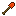</td>
</tr>
<tr>
<td align="center" style="border: 1px solid #555; width: 40px; height: 40px; padding: 4px;"></td>
<td align="center" style="border: 1px solid #555; width: 40px; height: 40px; padding: 4px;"></td>
<td align="center" style="border: 1px solid #555; width: 40px; height: 40px; padding: 4px;"></td>
</tr>
<tr>
<td align="center" style="border: 1px solid #555; width: 40px; height: 40px; padding: 4px;"></td>
<td align="center" style="border: 1px solid #555; width: 40px; height: 40px; padding: 4px;"></td>
<td align="center" style="border: 1px solid #555; width: 40px; height: 40px; padding: 4px;"></td>
</tr>
</table>

> **Crafting (Shaped):** 1 Burning Diamond + 2 Sticks ➞ 1 Burning Diamond Shovel

#### Burning Diamond Hoe

<table style="border-collapse: collapse;">
<tr>
<td align="center" style="border: 1px solid #555; width: 40px; height: 40px; padding: 4px;"></td>
<td align="center" style="border: 1px solid #555; width: 40px; height: 40px; padding: 4px;"></td>
<td align="center" style="border: 1px solid #555; width: 40px; height: 40px; padding: 4px;"></td>
<td rowspan="3" align="center" width="44" style="vertical-align: middle;">➞</td>
<td rowspan="3" align="center" style="vertical-align: middle; white-space: normal;">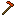</td>
</tr>
<tr>
<td align="center" style="border: 1px solid #555; width: 40px; height: 40px; padding: 4px;"></td>
<td align="center" style="border: 1px solid #555; width: 40px; height: 40px; padding: 4px;"></td>
<td align="center" style="border: 1px solid #555; width: 40px; height: 40px; padding: 4px;"></td>
</tr>
<tr>
<td align="center" style="border: 1px solid #555; width: 40px; height: 40px; padding: 4px;"></td>
<td align="center" style="border: 1px solid #555; width: 40px; height: 40px; padding: 4px;"></td>
<td align="center" style="border: 1px solid #555; width: 40px; height: 40px; padding: 4px;"></td>
</tr>
</table>

> **Crafting (Shaped):** 2 Burning Diamond + 2 Sticks ➞ 1 Burning Diamond Hoe

#### Burning Diamond Helmet

<table style="border-collapse: collapse;">
<tr>
<td align="center" style="border: 1px solid #555; width: 40px; height: 40px; padding: 4px;"></td>
<td align="center" style="border: 1px solid #555; width: 40px; height: 40px; padding: 4px;"></td>
<td align="center" style="border: 1px solid #555; width: 40px; height: 40px; padding: 4px;"></td>
<td rowspan="3" align="center" width="44" style="vertical-align: middle;">➞</td>
<td rowspan="3" align="center" style="vertical-align: middle; white-space: normal;"></td>
</tr>
<tr>
<td align="center" style="border: 1px solid #555; width: 40px; height: 40px; padding: 4px;"></td>
<td align="center" style="border: 1px solid #555; width: 40px; height: 40px; padding: 4px;"></td>
<td align="center" style="border: 1px solid #555; width: 40px; height: 40px; padding: 4px;"></td>
</tr>
<tr>
<td align="center" style="border: 1px solid #555; width: 40px; height: 40px; padding: 4px;"></td>
<td align="center" style="border: 1px solid #555; width: 40px; height: 40px; padding: 4px;"></td>
<td align="center" style="border: 1px solid #555; width: 40px; height: 40px; padding: 4px;"></td>
</tr>
</table>

> **Crafting (Shaped):** 5 Burning Diamond ➞ 1 Burning Diamond Helmet

#### Burning Diamond Chestplate

<table style="border-collapse: collapse;">
<tr>
<td align="center" style="border: 1px solid #555; width: 40px; height: 40px; padding: 4px;"></td>
<td align="center" style="border: 1px solid #555; width: 40px; height: 40px; padding: 4px;"></td>
<td align="center" style="border: 1px solid #555; width: 40px; height: 40px; padding: 4px;"></td>
<td rowspan="3" align="center" width="44" style="vertical-align: middle;">➞</td>
<td rowspan="3" align="center" style="vertical-align: middle; white-space: normal;"></td>
</tr>
<tr>
<td align="center" style="border: 1px solid #555; width: 40px; height: 40px; padding: 4px;"></td>
<td align="center" style="border: 1px solid #555; width: 40px; height: 40px; padding: 4px;"></td>
<td align="center" style="border: 1px solid #555; width: 40px; height: 40px; padding: 4px;"></td>
</tr>
<tr>
<td align="center" style="border: 1px solid #555; width: 40px; height: 40px; padding: 4px;"></td>
<td align="center" style="border: 1px solid #555; width: 40px; height: 40px; padding: 4px;"></td>
<td align="center" style="border: 1px solid #555; width: 40px; height: 40px; padding: 4px;"></td>
</tr>
</table>

> **Crafting (Shaped):** 8 Burning Diamond ➞ 1 Burning Diamond Chestplate

#### Burning Diamond Leggings

<table style="border-collapse: collapse;">
<tr>
<td align="center" style="border: 1px solid #555; width: 40px; height: 40px; padding: 4px;"></td>
<td align="center" style="border: 1px solid #555; width: 40px; height: 40px; padding: 4px;"></td>
<td align="center" style="border: 1px solid #555; width: 40px; height: 40px; padding: 4px;"></td>
<td rowspan="3" align="center" width="44" style="vertical-align: middle;">➞</td>
<td rowspan="3" align="center" style="vertical-align: middle; white-space: normal;"></td>
</tr>
<tr>
<td align="center" style="border: 1px solid #555; width: 40px; height: 40px; padding: 4px;"></td>
<td align="center" style="border: 1px solid #555; width: 40px; height: 40px; padding: 4px;"></td>
<td align="center" style="border: 1px solid #555; width: 40px; height: 40px; padding: 4px;"></td>
</tr>
<tr>
<td align="center" style="border: 1px solid #555; width: 40px; height: 40px; padding: 4px;"></td>
<td align="center" style="border: 1px solid #555; width: 40px; height: 40px; padding: 4px;"></td>
<td align="center" style="border: 1px solid #555; width: 40px; height: 40px; padding: 4px;"></td>
</tr>
</table>

> **Crafting (Shaped):** 7 Burning Diamond ➞ 1 Burning Diamond Leggings

#### Burning Diamond Boots

<table style="border-collapse: collapse;">
<tr>
<td align="center" style="border: 1px solid #555; width: 40px; height: 40px; padding: 4px;"></td>
<td align="center" style="border: 1px solid #555; width: 40px; height: 40px; padding: 4px;"></td>
<td align="center" style="border: 1px solid #555; width: 40px; height: 40px; padding: 4px;"></td>
<td rowspan="3" align="center" width="44" style="vertical-align: middle;">➞</td>
<td rowspan="3" align="center" style="vertical-align: middle; white-space: normal;"></td>
</tr>
<tr>
<td align="center" style="border: 1px solid #555; width: 40px; height: 40px; padding: 4px;"></td>
<td align="center" style="border: 1px solid #555; width: 40px; height: 40px; padding: 4px;"></td>
<td align="center" style="border: 1px solid #555; width: 40px; height: 40px; padding: 4px;"></td>
</tr>
<tr>
<td align="center" style="border: 1px solid #555; width: 40px; height: 40px; padding: 4px;"></td>
<td align="center" style="border: 1px solid #555; width: 40px; height: 40px; padding: 4px;"></td>
<td align="center" style="border: 1px solid #555; width: 40px; height: 40px; padding: 4px;"></td>
</tr>
</table>

> **Crafting (Shaped):** 4 Burning Diamond ➞ 1 Burning Diamond Boots

#### Block of Burning Diamond

<table style="border-collapse: collapse;">
<tr>
<td align="center" style="border: 1px solid #555; width: 40px; height: 40px; padding: 4px;"></td>
<td align="center" style="border: 1px solid #555; width: 40px; height: 40px; padding: 4px;"></td>
<td align="center" style="border: 1px solid #555; width: 40px; height: 40px; padding: 4px;"></td>
<td rowspan="3" align="center" width="44" style="vertical-align: middle;">➞</td>
<td rowspan="3" align="center" style="vertical-align: middle; white-space: normal;"></td>
</tr>
<tr>
<td align="center" style="border: 1px solid #555; width: 40px; height: 40px; padding: 4px;"></td>
<td align="center" style="border: 1px solid #555; width: 40px; height: 40px; padding: 4px;"></td>
<td align="center" style="border: 1px solid #555; width: 40px; height: 40px; padding: 4px;"></td>
</tr>
<tr>
<td align="center" style="border: 1px solid #555; width: 40px; height: 40px; padding: 4px;"></td>
<td align="center" style="border: 1px solid #555; width: 40px; height: 40px; padding: 4px;"></td>
<td align="center" style="border: 1px solid #555; width: 40px; height: 40px; padding: 4px;"></td>
</tr>
</table>

> **Crafting (Shaped):** 9 Burning Diamond ➞ 1 Block of Burning Diamond

#### Burning Diamond from Block

<table style="border-collapse: collapse;">
<tr>
<td align="center" style="border: 1px solid #555; width: 40px; height: 40px; padding: 4px;"></td>
<td align="center" width="44" style="vertical-align: middle;">➞</td>
<td align="center" style="vertical-align: middle; white-space: normal;"></td>
</tr>
</table>

> **Crafting (Shapeless):** 1 Block of Burning Diamond ➞ 9 Burning Diamond

#### Burning Diamond Torch

<table style="border-collapse: collapse;">
<tr>
<td align="center" style="border: 1px solid #555; width: 40px; height: 40px; padding: 4px;"></td>
<td align="center" style="border: 1px solid #555; width: 40px; height: 40px; padding: 4px;"></td>
<td align="center" style="border: 1px solid #555; width: 40px; height: 40px; padding: 4px;"></td>
<td rowspan="3" align="center" width="44" style="vertical-align: middle;">➞</td>
<td rowspan="3" align="center" style="vertical-align: middle; white-space: normal;"></td>
</tr>
<tr>
<td align="center" style="border: 1px solid #555; width: 40px; height: 40px; padding: 4px;"></td>
<td align="center" style="border: 1px solid #555; width: 40px; height: 40px; padding: 4px;"></td>
<td align="center" style="border: 1px solid #555; width: 40px; height: 40px; padding: 4px;"></td>
</tr>
<tr>
<td align="center" style="border: 1px solid #555; width: 40px; height: 40px; padding: 4px;"></td>
<td align="center" style="border: 1px solid #555; width: 40px; height: 40px; padding: 4px;"></td>
<td align="center" style="border: 1px solid #555; width: 40px; height: 40px; padding: 4px;"></td>
</tr>
</table>

> **Crafting (Shaped):** Burning Diamond above Coal above Stick ➞ 8 Burning Diamond Torches

---

### Platinum Recipes

#### Platinum Sword

<table style="border-collapse: collapse;">
<tr>
<td align="center" style="border: 1px solid #555; width: 40px; height: 40px; padding: 4px;"></td>
<td align="center" style="border: 1px solid #555; width: 40px; height: 40px; padding: 4px;"></td>
<td align="center" style="border: 1px solid #555; width: 40px; height: 40px; padding: 4px;"></td>
<td rowspan="3" align="center" width="44" style="vertical-align: middle;">➞</td>
<td rowspan="3" align="center" style="vertical-align: middle; white-space: normal;"></td>
</tr>
<tr>
<td align="center" style="border: 1px solid #555; width: 40px; height: 40px; padding: 4px;"></td>
<td align="center" style="border: 1px solid #555; width: 40px; height: 40px; padding: 4px;"></td>
<td align="center" style="border: 1px solid #555; width: 40px; height: 40px; padding: 4px;"></td>
</tr>
<tr>
<td align="center" style="border: 1px solid #555; width: 40px; height: 40px; padding: 4px;"></td>
<td align="center" style="border: 1px solid #555; width: 40px; height: 40px; padding: 4px;"></td>
<td align="center" style="border: 1px solid #555; width: 40px; height: 40px; padding: 4px;"></td>
</tr>
</table>

> **Crafting (Shaped):** 2 Platinum Ingot + 1 Stick ➞ 1 Platinum Sword

#### Platinum Pickaxe

<table style="border-collapse: collapse;">
<tr>
<td align="center" style="border: 1px solid #555; width: 40px; height: 40px; padding: 4px;"></td>
<td align="center" style="border: 1px solid #555; width: 40px; height: 40px; padding: 4px;"></td>
<td align="center" style="border: 1px solid #555; width: 40px; height: 40px; padding: 4px;"></td>
<td rowspan="3" align="center" width="44" style="vertical-align: middle;">➞</td>
<td rowspan="3" align="center" style="vertical-align: middle; white-space: normal;"></td>
</tr>
<tr>
<td align="center" style="border: 1px solid #555; width: 40px; height: 40px; padding: 4px;"></td>
<td align="center" style="border: 1px solid #555; width: 40px; height: 40px; padding: 4px;"></td>
<td align="center" style="border: 1px solid #555; width: 40px; height: 40px; padding: 4px;"></td>
</tr>
<tr>
<td align="center" style="border: 1px solid #555; width: 40px; height: 40px; padding: 4px;"></td>
<td align="center" style="border: 1px solid #555; width: 40px; height: 40px; padding: 4px;"></td>
<td align="center" style="border: 1px solid #555; width: 40px; height: 40px; padding: 4px;"></td>
</tr>
</table>

> **Crafting (Shaped):** 3 Platinum Ingot + 2 Sticks ➞ 1 Platinum Pickaxe

#### Platinum Axe

<table style="border-collapse: collapse;">
<tr>
<td align="center" style="border: 1px solid #555; width: 40px; height: 40px; padding: 4px;"></td>
<td align="center" style="border: 1px solid #555; width: 40px; height: 40px; padding: 4px;"></td>
<td align="center" style="border: 1px solid #555; width: 40px; height: 40px; padding: 4px;"></td>
<td rowspan="3" align="center" width="44" style="vertical-align: middle;">➞</td>
<td rowspan="3" align="center" style="vertical-align: middle; white-space: normal;"></td>
</tr>
<tr>
<td align="center" style="border: 1px solid #555; width: 40px; height: 40px; padding: 4px;"></td>
<td align="center" style="border: 1px solid #555; width: 40px; height: 40px; padding: 4px;"></td>
<td align="center" style="border: 1px solid #555; width: 40px; height: 40px; padding: 4px;"></td>
</tr>
<tr>
<td align="center" style="border: 1px solid #555; width: 40px; height: 40px; padding: 4px;"></td>
<td align="center" style="border: 1px solid #555; width: 40px; height: 40px; padding: 4px;"></td>
<td align="center" style="border: 1px solid #555; width: 40px; height: 40px; padding: 4px;"></td>
</tr>
</table>

> **Crafting (Shaped):** 3 Platinum Ingot + 2 Sticks ➞ 1 Platinum Axe

#### Platinum Shovel

<table style="border-collapse: collapse;">
<tr>
<td align="center" style="border: 1px solid #555; width: 40px; height: 40px; padding: 4px;"></td>
<td align="center" style="border: 1px solid #555; width: 40px; height: 40px; padding: 4px;"></td>
<td align="center" style="border: 1px solid #555; width: 40px; height: 40px; padding: 4px;"></td>
<td rowspan="3" align="center" width="44" style="vertical-align: middle;">➞</td>
<td rowspan="3" align="center" style="vertical-align: middle; white-space: normal;"></td>
</tr>
<tr>
<td align="center" style="border: 1px solid #555; width: 40px; height: 40px; padding: 4px;"></td>
<td align="center" style="border: 1px solid #555; width: 40px; height: 40px; padding: 4px;"></td>
<td align="center" style="border: 1px solid #555; width: 40px; height: 40px; padding: 4px;"></td>
</tr>
<tr>
<td align="center" style="border: 1px solid #555; width: 40px; height: 40px; padding: 4px;"></td>
<td align="center" style="border: 1px solid #555; width: 40px; height: 40px; padding: 4px;"></td>
<td align="center" style="border: 1px solid #555; width: 40px; height: 40px; padding: 4px;"></td>
</tr>
</table>

> **Crafting (Shaped):** 1 Platinum Ingot + 2 Sticks ➞ 1 Platinum Shovel

#### Platinum Hoe

<table style="border-collapse: collapse;">
<tr>
<td align="center" style="border: 1px solid #555; width: 40px; height: 40px; padding: 4px;"></td>
<td align="center" style="border: 1px solid #555; width: 40px; height: 40px; padding: 4px;"></td>
<td align="center" style="border: 1px solid #555; width: 40px; height: 40px; padding: 4px;"></td>
<td rowspan="3" align="center" width="44" style="vertical-align: middle;">➞</td>
<td rowspan="3" align="center" style="vertical-align: middle; white-space: normal;"></td>
</tr>
<tr>
<td align="center" style="border: 1px solid #555; width: 40px; height: 40px; padding: 4px;"></td>
<td align="center" style="border: 1px solid #555; width: 40px; height: 40px; padding: 4px;"></td>
<td align="center" style="border: 1px solid #555; width: 40px; height: 40px; padding: 4px;"></td>
</tr>
<tr>
<td align="center" style="border: 1px solid #555; width: 40px; height: 40px; padding: 4px;"></td>
<td align="center" style="border: 1px solid #555; width: 40px; height: 40px; padding: 4px;"></td>
<td align="center" style="border: 1px solid #555; width: 40px; height: 40px; padding: 4px;"></td>
</tr>
</table>

> **Crafting (Shaped):** 2 Platinum Ingot + 2 Sticks ➞ 1 Platinum Hoe

#### Platinum Helmet

<table style="border-collapse: collapse;">
<tr>
<td align="center" style="border: 1px solid #555; width: 40px; height: 40px; padding: 4px;"></td>
<td align="center" style="border: 1px solid #555; width: 40px; height: 40px; padding: 4px;"></td>
<td align="center" style="border: 1px solid #555; width: 40px; height: 40px; padding: 4px;"></td>
<td rowspan="3" align="center" width="44" style="vertical-align: middle;">➞</td>
<td rowspan="3" align="center" style="vertical-align: middle; white-space: normal;"></td>
</tr>
<tr>
<td align="center" style="border: 1px solid #555; width: 40px; height: 40px; padding: 4px;"></td>
<td align="center" style="border: 1px solid #555; width: 40px; height: 40px; padding: 4px;"></td>
<td align="center" style="border: 1px solid #555; width: 40px; height: 40px; padding: 4px;"></td>
</tr>
<tr>
<td align="center" style="border: 1px solid #555; width: 40px; height: 40px; padding: 4px;"></td>
<td align="center" style="border: 1px solid #555; width: 40px; height: 40px; padding: 4px;"></td>
<td align="center" style="border: 1px solid #555; width: 40px; height: 40px; padding: 4px;"></td>
</tr>
</table>

> **Crafting (Shaped):** 5 Platinum Ingot ➞ 1 Platinum Helmet

#### Platinum Chestplate

<table style="border-collapse: collapse;">
<tr>
<td align="center" style="border: 1px solid #555; width: 40px; height: 40px; padding: 4px;"></td>
<td align="center" style="border: 1px solid #555; width: 40px; height: 40px; padding: 4px;"></td>
<td align="center" style="border: 1px solid #555; width: 40px; height: 40px; padding: 4px;"></td>
<td rowspan="3" align="center" width="44" style="vertical-align: middle;">➞</td>
<td rowspan="3" align="center" style="vertical-align: middle; white-space: normal;"></td>
</tr>
<tr>
<td align="center" style="border: 1px solid #555; width: 40px; height: 40px; padding: 4px;"></td>
<td align="center" style="border: 1px solid #555; width: 40px; height: 40px; padding: 4px;"></td>
<td align="center" style="border: 1px solid #555; width: 40px; height: 40px; padding: 4px;"></td>
</tr>
<tr>
<td align="center" style="border: 1px solid #555; width: 40px; height: 40px; padding: 4px;"></td>
<td align="center" style="border: 1px solid #555; width: 40px; height: 40px; padding: 4px;"></td>
<td align="center" style="border: 1px solid #555; width: 40px; height: 40px; padding: 4px;"></td>
</tr>
</table>

> **Crafting (Shaped):** 8 Platinum Ingot ➞ 1 Platinum Chestplate

#### Platinum Leggings

<table style="border-collapse: collapse;">
<tr>
<td align="center" style="border: 1px solid #555; width: 40px; height: 40px; padding: 4px;"></td>
<td align="center" style="border: 1px solid #555; width: 40px; height: 40px; padding: 4px;"></td>
<td align="center" style="border: 1px solid #555; width: 40px; height: 40px; padding: 4px;"></td>
<td rowspan="3" align="center" width="44" style="vertical-align: middle;">➞</td>
<td rowspan="3" align="center" style="vertical-align: middle; white-space: normal;"></td>
</tr>
<tr>
<td align="center" style="border: 1px solid #555; width: 40px; height: 40px; padding: 4px;"></td>
<td align="center" style="border: 1px solid #555; width: 40px; height: 40px; padding: 4px;"></td>
<td align="center" style="border: 1px solid #555; width: 40px; height: 40px; padding: 4px;"></td>
</tr>
<tr>
<td align="center" style="border: 1px solid #555; width: 40px; height: 40px; padding: 4px;"></td>
<td align="center" style="border: 1px solid #555; width: 40px; height: 40px; padding: 4px;"></td>
<td align="center" style="border: 1px solid #555; width: 40px; height: 40px; padding: 4px;"></td>
</tr>
</table>

> **Crafting (Shaped):** 7 Platinum Ingot ➞ 1 Platinum Leggings

#### Platinum Boots

<table style="border-collapse: collapse;">
<tr>
<td align="center" style="border: 1px solid #555; width: 40px; height: 40px; padding: 4px;"></td>
<td align="center" style="border: 1px solid #555; width: 40px; height: 40px; padding: 4px;"></td>
<td align="center" style="border: 1px solid #555; width: 40px; height: 40px; padding: 4px;"></td>
<td rowspan="3" align="center" width="44" style="vertical-align: middle;">➞</td>
<td rowspan="3" align="center" style="vertical-align: middle; white-space: normal;"></td>
</tr>
<tr>
<td align="center" style="border: 1px solid #555; width: 40px; height: 40px; padding: 4px;"></td>
<td align="center" style="border: 1px solid #555; width: 40px; height: 40px; padding: 4px;"></td>
<td align="center" style="border: 1px solid #555; width: 40px; height: 40px; padding: 4px;"></td>
</tr>
<tr>
<td align="center" style="border: 1px solid #555; width: 40px; height: 40px; padding: 4px;"></td>
<td align="center" style="border: 1px solid #555; width: 40px; height: 40px; padding: 4px;"></td>
<td align="center" style="border: 1px solid #555; width: 40px; height: 40px; padding: 4px;"></td>
</tr>
</table>

> **Crafting (Shaped):** 4 Platinum Ingot ➞ 1 Platinum Boots

#### Block of Platinum

<table style="border-collapse: collapse;">
<tr>
<td align="center" style="border: 1px solid #555; width: 40px; height: 40px; padding: 4px;"></td>
<td align="center" style="border: 1px solid #555; width: 40px; height: 40px; padding: 4px;"></td>
<td align="center" style="border: 1px solid #555; width: 40px; height: 40px; padding: 4px;"></td>
<td rowspan="3" align="center" width="44" style="vertical-align: middle;">➞</td>
<td rowspan="3" align="center" style="vertical-align: middle; white-space: normal;"></td>
</tr>
<tr>
<td align="center" style="border: 1px solid #555; width: 40px; height: 40px; padding: 4px;"></td>
<td align="center" style="border: 1px solid #555; width: 40px; height: 40px; padding: 4px;"></td>
<td align="center" style="border: 1px solid #555; width: 40px; height: 40px; padding: 4px;"></td>
</tr>
<tr>
<td align="center" style="border: 1px solid #555; width: 40px; height: 40px; padding: 4px;"></td>
<td align="center" style="border: 1px solid #555; width: 40px; height: 40px; padding: 4px;"></td>
<td align="center" style="border: 1px solid #555; width: 40px; height: 40px; padding: 4px;"></td>
</tr>
</table>

> **Crafting (Shaped):** 9 Platinum Ingot ➞ 1 Block of Platinum

#### Platinum Ingot from Block

<table style="border-collapse: collapse;">
<tr>
<td align="center" style="border: 1px solid #555; width: 40px; height: 40px; padding: 4px;"></td>
<td align="center" width="44" style="vertical-align: middle;">➞</td>
<td align="center" style="vertical-align: middle; white-space: normal;"></td>
</tr>
</table>

> **Crafting (Shapeless):** 1 Block of Platinum ➞ 9 Platinum Ingot

#### Platinum Ingot from Nuggets

<table style="border-collapse: collapse;">
<tr>
<td align="center" style="border: 1px solid #555; width: 40px; height: 40px; padding: 4px;"></td>
<td align="center" style="border: 1px solid #555; width: 40px; height: 40px; padding: 4px;"></td>
<td align="center" style="border: 1px solid #555; width: 40px; height: 40px; padding: 4px;"></td>
<td rowspan="3" align="center" width="44" style="vertical-align: middle;">➞</td>
<td rowspan="3" align="center" style="vertical-align: middle; white-space: normal;"></td>
</tr>
<tr>
<td align="center" style="border: 1px solid #555; width: 40px; height: 40px; padding: 4px;"></td>
<td align="center" style="border: 1px solid #555; width: 40px; height: 40px; padding: 4px;"></td>
<td align="center" style="border: 1px solid #555; width: 40px; height: 40px; padding: 4px;"></td>
</tr>
<tr>
<td align="center" style="border: 1px solid #555; width: 40px; height: 40px; padding: 4px;"></td>
<td align="center" style="border: 1px solid #555; width: 40px; height: 40px; padding: 4px;"></td>
<td align="center" style="border: 1px solid #555; width: 40px; height: 40px; padding: 4px;"></td>
</tr>
</table>

> **Crafting (Shaped):** 9 Platinum Nuggets ➞ 1 Platinum Ingot

#### Platinum Nuggets from Ingot

<table style="border-collapse: collapse;">
<tr>
<td align="center" style="border: 1px solid #555; width: 40px; height: 40px; padding: 4px;"></td>
<td align="center" width="44" style="vertical-align: middle;">➞</td>
<td align="center" style="vertical-align: middle; white-space: normal;"></td>
</tr>
</table>

> **Crafting (Shapeless):** 1 Platinum Ingot ➞ 9 Platinum Nuggets

---

### Uranium Recipes

#### Uranium Sword

<table style="border-collapse: collapse;">
<tr>
<td align="center" style="border: 1px solid #555; width: 40px; height: 40px; padding: 4px;"></td>
<td align="center" style="border: 1px solid #555; width: 40px; height: 40px; padding: 4px;"></td>
<td align="center" style="border: 1px solid #555; width: 40px; height: 40px; padding: 4px;"></td>
<td rowspan="3" align="center" width="44" style="vertical-align: middle;">➞</td>
<td rowspan="3" align="center" style="vertical-align: middle; white-space: normal;"></td>
</tr>
<tr>
<td align="center" style="border: 1px solid #555; width: 40px; height: 40px; padding: 4px;"></td>
<td align="center" style="border: 1px solid #555; width: 40px; height: 40px; padding: 4px;"></td>
<td align="center" style="border: 1px solid #555; width: 40px; height: 40px; padding: 4px;"></td>
</tr>
<tr>
<td align="center" style="border: 1px solid #555; width: 40px; height: 40px; padding: 4px;"></td>
<td align="center" style="border: 1px solid #555; width: 40px; height: 40px; padding: 4px;"></td>
<td align="center" style="border: 1px solid #555; width: 40px; height: 40px; padding: 4px;"></td>
</tr>
</table>

> **Crafting (Shaped):** 2 Uranium Ingot + 1 Stick ➞ 1 Uranium Sword

#### Uranium Pickaxe

<table style="border-collapse: collapse;">
<tr>
<td align="center" style="border: 1px solid #555; width: 40px; height: 40px; padding: 4px;"></td>
<td align="center" style="border: 1px solid #555; width: 40px; height: 40px; padding: 4px;"></td>
<td align="center" style="border: 1px solid #555; width: 40px; height: 40px; padding: 4px;"></td>
<td rowspan="3" align="center" width="44" style="vertical-align: middle;">➞</td>
<td rowspan="3" align="center" style="vertical-align: middle; white-space: normal;"></td>
</tr>
<tr>
<td align="center" style="border: 1px solid #555; width: 40px; height: 40px; padding: 4px;"></td>
<td align="center" style="border: 1px solid #555; width: 40px; height: 40px; padding: 4px;"></td>
<td align="center" style="border: 1px solid #555; width: 40px; height: 40px; padding: 4px;"></td>
</tr>
<tr>
<td align="center" style="border: 1px solid #555; width: 40px; height: 40px; padding: 4px;"></td>
<td align="center" style="border: 1px solid #555; width: 40px; height: 40px; padding: 4px;"></td>
<td align="center" style="border: 1px solid #555; width: 40px; height: 40px; padding: 4px;"></td>
</tr>
</table>

> **Crafting (Shaped):** 3 Uranium Ingot + 2 Sticks ➞ 1 Uranium Pickaxe

#### Uranium Axe

<table style="border-collapse: collapse;">
<tr>
<td align="center" style="border: 1px solid #555; width: 40px; height: 40px; padding: 4px;"></td>
<td align="center" style="border: 1px solid #555; width: 40px; height: 40px; padding: 4px;"></td>
<td align="center" style="border: 1px solid #555; width: 40px; height: 40px; padding: 4px;"></td>
<td rowspan="3" align="center" width="44" style="vertical-align: middle;">➞</td>
<td rowspan="3" align="center" style="vertical-align: middle; white-space: normal;"></td>
</tr>
<tr>
<td align="center" style="border: 1px solid #555; width: 40px; height: 40px; padding: 4px;"></td>
<td align="center" style="border: 1px solid #555; width: 40px; height: 40px; padding: 4px;"></td>
<td align="center" style="border: 1px solid #555; width: 40px; height: 40px; padding: 4px;"></td>
</tr>
<tr>
<td align="center" style="border: 1px solid #555; width: 40px; height: 40px; padding: 4px;"></td>
<td align="center" style="border: 1px solid #555; width: 40px; height: 40px; padding: 4px;"></td>
<td align="center" style="border: 1px solid #555; width: 40px; height: 40px; padding: 4px;"></td>
</tr>
</table>

> **Crafting (Shaped):** 3 Uranium Ingot + 2 Sticks ➞ 1 Uranium Axe

#### Uranium Shovel

<table style="border-collapse: collapse;">
<tr>
<td align="center" style="border: 1px solid #555; width: 40px; height: 40px; padding: 4px;"></td>
<td align="center" style="border: 1px solid #555; width: 40px; height: 40px; padding: 4px;"></td>
<td align="center" style="border: 1px solid #555; width: 40px; height: 40px; padding: 4px;"></td>
<td rowspan="3" align="center" width="44" style="vertical-align: middle;">➞</td>
<td rowspan="3" align="center" style="vertical-align: middle; white-space: normal;"></td>
</tr>
<tr>
<td align="center" style="border: 1px solid #555; width: 40px; height: 40px; padding: 4px;"></td>
<td align="center" style="border: 1px solid #555; width: 40px; height: 40px; padding: 4px;"></td>
<td align="center" style="border: 1px solid #555; width: 40px; height: 40px; padding: 4px;"></td>
</tr>
<tr>
<td align="center" style="border: 1px solid #555; width: 40px; height: 40px; padding: 4px;"></td>
<td align="center" style="border: 1px solid #555; width: 40px; height: 40px; padding: 4px;"></td>
<td align="center" style="border: 1px solid #555; width: 40px; height: 40px; padding: 4px;"></td>
</tr>
</table>

> **Crafting (Shaped):** 1 Uranium Ingot + 2 Sticks ➞ 1 Uranium Shovel

#### Uranium Hoe

<table style="border-collapse: collapse;">
<tr>
<td align="center" style="border: 1px solid #555; width: 40px; height: 40px; padding: 4px;"></td>
<td align="center" style="border: 1px solid #555; width: 40px; height: 40px; padding: 4px;"></td>
<td align="center" style="border: 1px solid #555; width: 40px; height: 40px; padding: 4px;"></td>
<td rowspan="3" align="center" width="44" style="vertical-align: middle;">➞</td>
<td rowspan="3" align="center" style="vertical-align: middle; white-space: normal;"></td>
</tr>
<tr>
<td align="center" style="border: 1px solid #555; width: 40px; height: 40px; padding: 4px;"></td>
<td align="center" style="border: 1px solid #555; width: 40px; height: 40px; padding: 4px;"></td>
<td align="center" style="border: 1px solid #555; width: 40px; height: 40px; padding: 4px;"></td>
</tr>
<tr>
<td align="center" style="border: 1px solid #555; width: 40px; height: 40px; padding: 4px;"></td>
<td align="center" style="border: 1px solid #555; width: 40px; height: 40px; padding: 4px;"></td>
<td align="center" style="border: 1px solid #555; width: 40px; height: 40px; padding: 4px;"></td>
</tr>
</table>

> **Crafting (Shaped):** 2 Uranium Ingot + 2 Sticks ➞ 1 Uranium Hoe

#### Uranium Helmet

<table style="border-collapse: collapse;">
<tr>
<td align="center" style="border: 1px solid #555; width: 40px; height: 40px; padding: 4px;"></td>
<td align="center" style="border: 1px solid #555; width: 40px; height: 40px; padding: 4px;"></td>
<td align="center" style="border: 1px solid #555; width: 40px; height: 40px; padding: 4px;"></td>
<td rowspan="3" align="center" width="44" style="vertical-align: middle;">➞</td>
<td rowspan="3" align="center" style="vertical-align: middle; white-space: normal;"></td>
</tr>
<tr>
<td align="center" style="border: 1px solid #555; width: 40px; height: 40px; padding: 4px;"></td>
<td align="center" style="border: 1px solid #555; width: 40px; height: 40px; padding: 4px;"></td>
<td align="center" style="border: 1px solid #555; width: 40px; height: 40px; padding: 4px;"></td>
</tr>
<tr>
<td align="center" style="border: 1px solid #555; width: 40px; height: 40px; padding: 4px;"></td>
<td align="center" style="border: 1px solid #555; width: 40px; height: 40px; padding: 4px;"></td>
<td align="center" style="border: 1px solid #555; width: 40px; height: 40px; padding: 4px;"></td>
</tr>
</table>

> **Crafting (Shaped):** 5 Uranium Ingot ➞ 1 Uranium Helmet

#### Uranium Chestplate

<table style="border-collapse: collapse;">
<tr>
<td align="center" style="border: 1px solid #555; width: 40px; height: 40px; padding: 4px;"></td>
<td align="center" style="border: 1px solid #555; width: 40px; height: 40px; padding: 4px;"></td>
<td align="center" style="border: 1px solid #555; width: 40px; height: 40px; padding: 4px;"></td>
<td rowspan="3" align="center" width="44" style="vertical-align: middle;">➞</td>
<td rowspan="3" align="center" style="vertical-align: middle; white-space: normal;"></td>
</tr>
<tr>
<td align="center" style="border: 1px solid #555; width: 40px; height: 40px; padding: 4px;"></td>
<td align="center" style="border: 1px solid #555; width: 40px; height: 40px; padding: 4px;"></td>
<td align="center" style="border: 1px solid #555; width: 40px; height: 40px; padding: 4px;"></td>
</tr>
<tr>
<td align="center" style="border: 1px solid #555; width: 40px; height: 40px; padding: 4px;"></td>
<td align="center" style="border: 1px solid #555; width: 40px; height: 40px; padding: 4px;"></td>
<td align="center" style="border: 1px solid #555; width: 40px; height: 40px; padding: 4px;"></td>
</tr>
</table>

> **Crafting (Shaped):** 8 Uranium Ingot ➞ 1 Uranium Chestplate

#### Uranium Leggings

<table style="border-collapse: collapse;">
<tr>
<td align="center" style="border: 1px solid #555; width: 40px; height: 40px; padding: 4px;"></td>
<td align="center" style="border: 1px solid #555; width: 40px; height: 40px; padding: 4px;"></td>
<td align="center" style="border: 1px solid #555; width: 40px; height: 40px; padding: 4px;"></td>
<td rowspan="3" align="center" width="44" style="vertical-align: middle;">➞</td>
<td rowspan="3" align="center" style="vertical-align: middle; white-space: normal;"></td>
</tr>
<tr>
<td align="center" style="border: 1px solid #555; width: 40px; height: 40px; padding: 4px;"></td>
<td align="center" style="border: 1px solid #555; width: 40px; height: 40px; padding: 4px;"></td>
<td align="center" style="border: 1px solid #555; width: 40px; height: 40px; padding: 4px;"></td>
</tr>
<tr>
<td align="center" style="border: 1px solid #555; width: 40px; height: 40px; padding: 4px;"></td>
<td align="center" style="border: 1px solid #555; width: 40px; height: 40px; padding: 4px;"></td>
<td align="center" style="border: 1px solid #555; width: 40px; height: 40px; padding: 4px;"></td>
</tr>
</table>

> **Crafting (Shaped):** 7 Uranium Ingot ➞ 1 Uranium Leggings

#### Uranium Boots

<table style="border-collapse: collapse;">
<tr>
<td align="center" style="border: 1px solid #555; width: 40px; height: 40px; padding: 4px;"></td>
<td align="center" style="border: 1px solid #555; width: 40px; height: 40px; padding: 4px;"></td>
<td align="center" style="border: 1px solid #555; width: 40px; height: 40px; padding: 4px;"></td>
<td rowspan="3" align="center" width="44" style="vertical-align: middle;">➞</td>
<td rowspan="3" align="center" style="vertical-align: middle; white-space: normal;"></td>
</tr>
<tr>
<td align="center" style="border: 1px solid #555; width: 40px; height: 40px; padding: 4px;"></td>
<td align="center" style="border: 1px solid #555; width: 40px; height: 40px; padding: 4px;"></td>
<td align="center" style="border: 1px solid #555; width: 40px; height: 40px; padding: 4px;"></td>
</tr>
<tr>
<td align="center" style="border: 1px solid #555; width: 40px; height: 40px; padding: 4px;"></td>
<td align="center" style="border: 1px solid #555; width: 40px; height: 40px; padding: 4px;"></td>
<td align="center" style="border: 1px solid #555; width: 40px; height: 40px; padding: 4px;"></td>
</tr>
</table>

> **Crafting (Shaped):** 4 Uranium Ingot ➞ 1 Uranium Boots

#### Block of Uranium

<table style="border-collapse: collapse;">
<tr>
<td align="center" style="border: 1px solid #555; width: 40px; height: 40px; padding: 4px;"></td>
<td align="center" style="border: 1px solid #555; width: 40px; height: 40px; padding: 4px;"></td>
<td align="center" style="border: 1px solid #555; width: 40px; height: 40px; padding: 4px;"></td>
<td rowspan="3" align="center" width="44" style="vertical-align: middle;">➞</td>
<td rowspan="3" align="center" style="vertical-align: middle; white-space: normal;"></td>
</tr>
<tr>
<td align="center" style="border: 1px solid #555; width: 40px; height: 40px; padding: 4px;"></td>
<td align="center" style="border: 1px solid #555; width: 40px; height: 40px; padding: 4px;"></td>
<td align="center" style="border: 1px solid #555; width: 40px; height: 40px; padding: 4px;"></td>
</tr>
<tr>
<td align="center" style="border: 1px solid #555; width: 40px; height: 40px; padding: 4px;"></td>
<td align="center" style="border: 1px solid #555; width: 40px; height: 40px; padding: 4px;"></td>
<td align="center" style="border: 1px solid #555; width: 40px; height: 40px; padding: 4px;"></td>
</tr>
</table>

> **Crafting (Shaped):** 9 Uranium Ingot ➞ 1 Block of Uranium

#### Uranium Ingot from Block

<table style="border-collapse: collapse;">
<tr>
<td align="center" style="border: 1px solid #555; width: 40px; height: 40px; padding: 4px;"></td>
<td align="center" width="44" style="vertical-align: middle;">➞</td>
<td align="center" style="vertical-align: middle; white-space: normal;"></td>
</tr>
</table>

> **Crafting (Shapeless):** 1 Block of Uranium ➞ 9 Uranium Ingot

#### Uranium Ingot from Nuggets

<table style="border-collapse: collapse;">
<tr>
<td align="center" style="border: 1px solid #555; width: 40px; height: 40px; padding: 4px;"></td>
<td align="center" style="border: 1px solid #555; width: 40px; height: 40px; padding: 4px;"></td>
<td align="center" style="border: 1px solid #555; width: 40px; height: 40px; padding: 4px;"></td>
<td rowspan="3" align="center" width="44" style="vertical-align: middle;">➞</td>
<td rowspan="3" align="center" style="vertical-align: middle; white-space: normal;"></td>
</tr>
<tr>
<td align="center" style="border: 1px solid #555; width: 40px; height: 40px; padding: 4px;"></td>
<td align="center" style="border: 1px solid #555; width: 40px; height: 40px; padding: 4px;"></td>
<td align="center" style="border: 1px solid #555; width: 40px; height: 40px; padding: 4px;"></td>
</tr>
<tr>
<td align="center" style="border: 1px solid #555; width: 40px; height: 40px; padding: 4px;"></td>
<td align="center" style="border: 1px solid #555; width: 40px; height: 40px; padding: 4px;"></td>
<td align="center" style="border: 1px solid #555; width: 40px; height: 40px; padding: 4px;"></td>
</tr>
</table>

> **Crafting (Shaped):** 9 Uranium Nuggets ➞ 1 Uranium Ingot

#### Uranium Nuggets from Ingot

<table style="border-collapse: collapse;">
<tr>
<td align="center" style="border: 1px solid #555; width: 40px; height: 40px; padding: 4px;"></td>
<td align="center" width="44" style="vertical-align: middle;">➞</td>
<td align="center" style="vertical-align: middle; white-space: normal;"></td>
</tr>
</table>

> **Crafting (Shapeless):** 1 Uranium Ingot ➞ 9 Uranium Nuggets

---

### Bloodstone Recipes

#### Bloodstone Helmet

<table style="border-collapse: collapse;">
<tr>
<td align="center" style="border: 1px solid #555; width: 40px; height: 40px; padding: 4px;"></td>
<td align="center" style="border: 1px solid #555; width: 40px; height: 40px; padding: 4px;"></td>
<td align="center" style="border: 1px solid #555; width: 40px; height: 40px; padding: 4px;"></td>
<td rowspan="3" align="center" width="44" style="vertical-align: middle;">➞</td>
<td rowspan="3" align="center" style="vertical-align: middle; white-space: normal;"></td>
</tr>
<tr>
<td align="center" style="border: 1px solid #555; width: 40px; height: 40px; padding: 4px;"></td>
<td align="center" style="border: 1px solid #555; width: 40px; height: 40px; padding: 4px;"></td>
<td align="center" style="border: 1px solid #555; width: 40px; height: 40px; padding: 4px;"></td>
</tr>
<tr>
<td align="center" style="border: 1px solid #555; width: 40px; height: 40px; padding: 4px;"></td>
<td align="center" style="border: 1px solid #555; width: 40px; height: 40px; padding: 4px;"></td>
<td align="center" style="border: 1px solid #555; width: 40px; height: 40px; padding: 4px;"></td>
</tr>
</table>

> **Crafting (Shaped):** 5 Bloodstone ➞ 1 Bloodstone Helmet

#### Bloodstone Chestplate

<table style="border-collapse: collapse;">
<tr>
<td align="center" style="border: 1px solid #555; width: 40px; height: 40px; padding: 4px;"></td>
<td align="center" style="border: 1px solid #555; width: 40px; height: 40px; padding: 4px;"></td>
<td align="center" style="border: 1px solid #555; width: 40px; height: 40px; padding: 4px;"></td>
<td rowspan="3" align="center" width="44" style="vertical-align: middle;">➞</td>
<td rowspan="3" align="center" style="vertical-align: middle; white-space: normal;"></td>
</tr>
<tr>
<td align="center" style="border: 1px solid #555; width: 40px; height: 40px; padding: 4px;"></td>
<td align="center" style="border: 1px solid #555; width: 40px; height: 40px; padding: 4px;"></td>
<td align="center" style="border: 1px solid #555; width: 40px; height: 40px; padding: 4px;"></td>
</tr>
<tr>
<td align="center" style="border: 1px solid #555; width: 40px; height: 40px; padding: 4px;"></td>
<td align="center" style="border: 1px solid #555; width: 40px; height: 40px; padding: 4px;"></td>
<td align="center" style="border: 1px solid #555; width: 40px; height: 40px; padding: 4px;"></td>
</tr>
</table>

> **Crafting (Shaped):** 8 Bloodstone ➞ 1 Bloodstone Chestplate

#### Bloodstone Leggings

<table style="border-collapse: collapse;">
<tr>
<td align="center" style="border: 1px solid #555; width: 40px; height: 40px; padding: 4px;"></td>
<td align="center" style="border: 1px solid #555; width: 40px; height: 40px; padding: 4px;"></td>
<td align="center" style="border: 1px solid #555; width: 40px; height: 40px; padding: 4px;"></td>
<td rowspan="3" align="center" width="44" style="vertical-align: middle;">➞</td>
<td rowspan="3" align="center" style="vertical-align: middle; white-space: normal;"></td>
</tr>
<tr>
<td align="center" style="border: 1px solid #555; width: 40px; height: 40px; padding: 4px;"></td>
<td align="center" style="border: 1px solid #555; width: 40px; height: 40px; padding: 4px;"></td>
<td align="center" style="border: 1px solid #555; width: 40px; height: 40px; padding: 4px;"></td>
</tr>
<tr>
<td align="center" style="border: 1px solid #555; width: 40px; height: 40px; padding: 4px;"></td>
<td align="center" style="border: 1px solid #555; width: 40px; height: 40px; padding: 4px;"></td>
<td align="center" style="border: 1px solid #555; width: 40px; height: 40px; padding: 4px;"></td>
</tr>
</table>

> **Crafting (Shaped):** 7 Bloodstone ➞ 1 Bloodstone Leggings

#### Bloodstone Boots

<table style="border-collapse: collapse;">
<tr>
<td align="center" style="border: 1px solid #555; width: 40px; height: 40px; padding: 4px;"></td>
<td align="center" style="border: 1px solid #555; width: 40px; height: 40px; padding: 4px;"></td>
<td align="center" style="border: 1px solid #555; width: 40px; height: 40px; padding: 4px;"></td>
<td rowspan="3" align="center" width="44" style="vertical-align: middle;">➞</td>
<td rowspan="3" align="center" style="vertical-align: middle; white-space: normal;"></td>
</tr>
<tr>
<td align="center" style="border: 1px solid #555; width: 40px; height: 40px; padding: 4px;"></td>
<td align="center" style="border: 1px solid #555; width: 40px; height: 40px; padding: 4px;"></td>
<td align="center" style="border: 1px solid #555; width: 40px; height: 40px; padding: 4px;"></td>
</tr>
<tr>
<td align="center" style="border: 1px solid #555; width: 40px; height: 40px; padding: 4px;"></td>
<td align="center" style="border: 1px solid #555; width: 40px; height: 40px; padding: 4px;"></td>
<td align="center" style="border: 1px solid #555; width: 40px; height: 40px; padding: 4px;"></td>
</tr>
</table>

> **Crafting (Shaped):** 4 Bloodstone ➞ 1 Bloodstone Boots

#### Block of Bloodstone

<table style="border-collapse: collapse;">
<tr>
<td align="center" style="border: 1px solid #555; width: 40px; height: 40px; padding: 4px;"></td>
<td align="center" style="border: 1px solid #555; width: 40px; height: 40px; padding: 4px;"></td>
<td align="center" style="border: 1px solid #555; width: 40px; height: 40px; padding: 4px;"></td>
<td rowspan="3" align="center" width="44" style="vertical-align: middle;">➞</td>
<td rowspan="3" align="center" style="vertical-align: middle; white-space: normal;"></td>
</tr>
<tr>
<td align="center" style="border: 1px solid #555; width: 40px; height: 40px; padding: 4px;"></td>
<td align="center" style="border: 1px solid #555; width: 40px; height: 40px; padding: 4px;"></td>
<td align="center" style="border: 1px solid #555; width: 40px; height: 40px; padding: 4px;"></td>
</tr>
<tr>
<td align="center" style="border: 1px solid #555; width: 40px; height: 40px; padding: 4px;"></td>
<td align="center" style="border: 1px solid #555; width: 40px; height: 40px; padding: 4px;"></td>
<td align="center" style="border: 1px solid #555; width: 40px; height: 40px; padding: 4px;"></td>
</tr>
</table>

> **Crafting (Shaped):** 9 Bloodstone ➞ 1 Block of Bloodstone

#### Bloodstone from Block

<table style="border-collapse: collapse;">
<tr>
<td align="center" style="border: 1px solid #555; width: 40px; height: 40px; padding: 4px;"></td>
<td align="center" width="44" style="vertical-align: middle;">➞</td>
<td align="center" style="vertical-align: middle; white-space: normal;"></td>
</tr>
</table>

> **Crafting (Shapeless):** 1 Block of Bloodstone ➞ 9 Bloodstone

---

### Ender Recipes

#### Ender Sword

<table style="border-collapse: collapse;">
<tr>
<td align="center" style="border: 1px solid #555; width: 40px; height: 40px; padding: 4px;"></td>
<td align="center" style="border: 1px solid #555; width: 40px; height: 40px; padding: 4px;"></td>
<td align="center" style="border: 1px solid #555; width: 40px; height: 40px; padding: 4px;"></td>
<td rowspan="3" align="center" width="44" style="vertical-align: middle;">➞</td>
<td rowspan="3" align="center" style="vertical-align: middle; white-space: normal;"></td>
</tr>
<tr>
<td align="center" style="border: 1px solid #555; width: 40px; height: 40px; padding: 4px;"></td>
<td align="center" style="border: 1px solid #555; width: 40px; height: 40px; padding: 4px;"></td>
<td align="center" style="border: 1px solid #555; width: 40px; height: 40px; padding: 4px;"></td>
</tr>
<tr>
<td align="center" style="border: 1px solid #555; width: 40px; height: 40px; padding: 4px;"></td>
<td align="center" style="border: 1px solid #555; width: 40px; height: 40px; padding: 4px;"></td>
<td align="center" style="border: 1px solid #555; width: 40px; height: 40px; padding: 4px;"></td>
</tr>
</table>

> **Crafting (Shaped):** 2 Ender Gem + 1 Stick ➞ 1 Ender Sword

#### Ender Pickaxe

<table style="border-collapse: collapse;">
<tr>
<td align="center" style="border: 1px solid #555; width: 40px; height: 40px; padding: 4px;"></td>
<td align="center" style="border: 1px solid #555; width: 40px; height: 40px; padding: 4px;"></td>
<td align="center" style="border: 1px solid #555; width: 40px; height: 40px; padding: 4px;"></td>
<td rowspan="3" align="center" width="44" style="vertical-align: middle;">➞</td>
<td rowspan="3" align="center" style="vertical-align: middle; white-space: normal;"></td>
</tr>
<tr>
<td align="center" style="border: 1px solid #555; width: 40px; height: 40px; padding: 4px;"></td>
<td align="center" style="border: 1px solid #555; width: 40px; height: 40px; padding: 4px;"></td>
<td align="center" style="border: 1px solid #555; width: 40px; height: 40px; padding: 4px;"></td>
</tr>
<tr>
<td align="center" style="border: 1px solid #555; width: 40px; height: 40px; padding: 4px;"></td>
<td align="center" style="border: 1px solid #555; width: 40px; height: 40px; padding: 4px;"></td>
<td align="center" style="border: 1px solid #555; width: 40px; height: 40px; padding: 4px;"></td>
</tr>
</table>

> **Crafting (Shaped):** 3 Ender Gem + 2 Sticks ➞ 1 Ender Pickaxe

#### Ender Axe

<table style="border-collapse: collapse;">
<tr>
<td align="center" style="border: 1px solid #555; width: 40px; height: 40px; padding: 4px;"></td>
<td align="center" style="border: 1px solid #555; width: 40px; height: 40px; padding: 4px;"></td>
<td align="center" style="border: 1px solid #555; width: 40px; height: 40px; padding: 4px;"></td>
<td rowspan="3" align="center" width="44" style="vertical-align: middle;">➞</td>
<td rowspan="3" align="center" style="vertical-align: middle; white-space: normal;"></td>
</tr>
<tr>
<td align="center" style="border: 1px solid #555; width: 40px; height: 40px; padding: 4px;"></td>
<td align="center" style="border: 1px solid #555; width: 40px; height: 40px; padding: 4px;"></td>
<td align="center" style="border: 1px solid #555; width: 40px; height: 40px; padding: 4px;"></td>
</tr>
<tr>
<td align="center" style="border: 1px solid #555; width: 40px; height: 40px; padding: 4px;"></td>
<td align="center" style="border: 1px solid #555; width: 40px; height: 40px; padding: 4px;"></td>
<td align="center" style="border: 1px solid #555; width: 40px; height: 40px; padding: 4px;"></td>
</tr>
</table>

> **Crafting (Shaped):** 3 Ender Gem + 2 Sticks ➞ 1 Ender Axe

#### Ender Shovel

<table style="border-collapse: collapse;">
<tr>
<td align="center" style="border: 1px solid #555; width: 40px; height: 40px; padding: 4px;"></td>
<td align="center" style="border: 1px solid #555; width: 40px; height: 40px; padding: 4px;"></td>
<td align="center" style="border: 1px solid #555; width: 40px; height: 40px; padding: 4px;"></td>
<td rowspan="3" align="center" width="44" style="vertical-align: middle;">➞</td>
<td rowspan="3" align="center" style="vertical-align: middle; white-space: normal;"></td>
</tr>
<tr>
<td align="center" style="border: 1px solid #555; width: 40px; height: 40px; padding: 4px;"></td>
<td align="center" style="border: 1px solid #555; width: 40px; height: 40px; padding: 4px;"></td>
<td align="center" style="border: 1px solid #555; width: 40px; height: 40px; padding: 4px;"></td>
</tr>
<tr>
<td align="center" style="border: 1px solid #555; width: 40px; height: 40px; padding: 4px;"></td>
<td align="center" style="border: 1px solid #555; width: 40px; height: 40px; padding: 4px;"></td>
<td align="center" style="border: 1px solid #555; width: 40px; height: 40px; padding: 4px;"></td>
</tr>
</table>

> **Crafting (Shaped):** 1 Ender Gem + 2 Sticks ➞ 1 Ender Shovel

#### Ender Hoe

<table style="border-collapse: collapse;">
<tr>
<td align="center" style="border: 1px solid #555; width: 40px; height: 40px; padding: 4px;"></td>
<td align="center" style="border: 1px solid #555; width: 40px; height: 40px; padding: 4px;"></td>
<td align="center" style="border: 1px solid #555; width: 40px; height: 40px; padding: 4px;"></td>
<td rowspan="3" align="center" width="44" style="vertical-align: middle;">➞</td>
<td rowspan="3" align="center" style="vertical-align: middle; white-space: normal;"></td>
</tr>
<tr>
<td align="center" style="border: 1px solid #555; width: 40px; height: 40px; padding: 4px;"></td>
<td align="center" style="border: 1px solid #555; width: 40px; height: 40px; padding: 4px;"></td>
<td align="center" style="border: 1px solid #555; width: 40px; height: 40px; padding: 4px;"></td>
</tr>
<tr>
<td align="center" style="border: 1px solid #555; width: 40px; height: 40px; padding: 4px;"></td>
<td align="center" style="border: 1px solid #555; width: 40px; height: 40px; padding: 4px;"></td>
<td align="center" style="border: 1px solid #555; width: 40px; height: 40px; padding: 4px;"></td>
</tr>
</table>

> **Crafting (Shaped):** 2 Ender Gem + 2 Sticks ➞ 1 Ender Hoe

#### Ender Helmet

<table style="border-collapse: collapse;">
<tr>
<td align="center" style="border: 1px solid #555; width: 40px; height: 40px; padding: 4px;"></td>
<td align="center" style="border: 1px solid #555; width: 40px; height: 40px; padding: 4px;"></td>
<td align="center" style="border: 1px solid #555; width: 40px; height: 40px; padding: 4px;"></td>
<td rowspan="3" align="center" width="44" style="vertical-align: middle;">➞</td>
<td rowspan="3" align="center" style="vertical-align: middle; white-space: normal;"></td>
</tr>
<tr>
<td align="center" style="border: 1px solid #555; width: 40px; height: 40px; padding: 4px;"></td>
<td align="center" style="border: 1px solid #555; width: 40px; height: 40px; padding: 4px;"></td>
<td align="center" style="border: 1px solid #555; width: 40px; height: 40px; padding: 4px;"></td>
</tr>
<tr>
<td align="center" style="border: 1px solid #555; width: 40px; height: 40px; padding: 4px;"></td>
<td align="center" style="border: 1px solid #555; width: 40px; height: 40px; padding: 4px;"></td>
<td align="center" style="border: 1px solid #555; width: 40px; height: 40px; padding: 4px;"></td>
</tr>
</table>

> **Crafting (Shaped):** 5 Ender Gem ➞ 1 Ender Helmet

#### Ender Chestplate

<table style="border-collapse: collapse;">
<tr>
<td align="center" style="border: 1px solid #555; width: 40px; height: 40px; padding: 4px;"></td>
<td align="center" style="border: 1px solid #555; width: 40px; height: 40px; padding: 4px;"></td>
<td align="center" style="border: 1px solid #555; width: 40px; height: 40px; padding: 4px;"></td>
<td rowspan="3" align="center" width="44" style="vertical-align: middle;">➞</td>
<td rowspan="3" align="center" style="vertical-align: middle; white-space: normal;"></td>
</tr>
<tr>
<td align="center" style="border: 1px solid #555; width: 40px; height: 40px; padding: 4px;"></td>
<td align="center" style="border: 1px solid #555; width: 40px; height: 40px; padding: 4px;"></td>
<td align="center" style="border: 1px solid #555; width: 40px; height: 40px; padding: 4px;"></td>
</tr>
<tr>
<td align="center" style="border: 1px solid #555; width: 40px; height: 40px; padding: 4px;"></td>
<td align="center" style="border: 1px solid #555; width: 40px; height: 40px; padding: 4px;"></td>
<td align="center" style="border: 1px solid #555; width: 40px; height: 40px; padding: 4px;"></td>
</tr>
</table>

> **Crafting (Shaped):** 8 Ender Gem ➞ 1 Ender Chestplate

#### Ender Leggings

<table style="border-collapse: collapse;">
<tr>
<td align="center" style="border: 1px solid #555; width: 40px; height: 40px; padding: 4px;"></td>
<td align="center" style="border: 1px solid #555; width: 40px; height: 40px; padding: 4px;"></td>
<td align="center" style="border: 1px solid #555; width: 40px; height: 40px; padding: 4px;"></td>
<td rowspan="3" align="center" width="44" style="vertical-align: middle;">➞</td>
<td rowspan="3" align="center" style="vertical-align: middle; white-space: normal;"></td>
</tr>
<tr>
<td align="center" style="border: 1px solid #555; width: 40px; height: 40px; padding: 4px;"></td>
<td align="center" style="border: 1px solid #555; width: 40px; height: 40px; padding: 4px;"></td>
<td align="center" style="border: 1px solid #555; width: 40px; height: 40px; padding: 4px;"></td>
</tr>
<tr>
<td align="center" style="border: 1px solid #555; width: 40px; height: 40px; padding: 4px;"></td>
<td align="center" style="border: 1px solid #555; width: 40px; height: 40px; padding: 4px;"></td>
<td align="center" style="border: 1px solid #555; width: 40px; height: 40px; padding: 4px;"></td>
</tr>
</table>

> **Crafting (Shaped):** 7 Ender Gem ➞ 1 Ender Leggings

#### Ender Boots

<table style="border-collapse: collapse;">
<tr>
<td align="center" style="border: 1px solid #555; width: 40px; height: 40px; padding: 4px;"></td>
<td align="center" style="border: 1px solid #555; width: 40px; height: 40px; padding: 4px;"></td>
<td align="center" style="border: 1px solid #555; width: 40px; height: 40px; padding: 4px;"></td>
<td rowspan="3" align="center" width="44" style="vertical-align: middle;">➞</td>
<td rowspan="3" align="center" style="vertical-align: middle; white-space: normal;"></td>
</tr>
<tr>
<td align="center" style="border: 1px solid #555; width: 40px; height: 40px; padding: 4px;"></td>
<td align="center" style="border: 1px solid #555; width: 40px; height: 40px; padding: 4px;"></td>
<td align="center" style="border: 1px solid #555; width: 40px; height: 40px; padding: 4px;"></td>
</tr>
<tr>
<td align="center" style="border: 1px solid #555; width: 40px; height: 40px; padding: 4px;"></td>
<td align="center" style="border: 1px solid #555; width: 40px; height: 40px; padding: 4px;"></td>
<td align="center" style="border: 1px solid #555; width: 40px; height: 40px; padding: 4px;"></td>
</tr>
</table>

> **Crafting (Shaped):** 4 Ender Gem ➞ 1 Ender Boots

#### Block of Ender

<table style="border-collapse: collapse;">
<tr>
<td align="center" style="border: 1px solid #555; width: 40px; height: 40px; padding: 4px;"></td>
<td align="center" style="border: 1px solid #555; width: 40px; height: 40px; padding: 4px;"></td>
<td align="center" style="border: 1px solid #555; width: 40px; height: 40px; padding: 4px;"></td>
<td rowspan="3" align="center" width="44" style="vertical-align: middle;">➞</td>
<td rowspan="3" align="center" style="vertical-align: middle; white-space: normal;"></td>
</tr>
<tr>
<td align="center" style="border: 1px solid #555; width: 40px; height: 40px; padding: 4px;"></td>
<td align="center" style="border: 1px solid #555; width: 40px; height: 40px; padding: 4px;"></td>
<td align="center" style="border: 1px solid #555; width: 40px; height: 40px; padding: 4px;"></td>
</tr>
<tr>
<td align="center" style="border: 1px solid #555; width: 40px; height: 40px; padding: 4px;"></td>
<td align="center" style="border: 1px solid #555; width: 40px; height: 40px; padding: 4px;"></td>
<td align="center" style="border: 1px solid #555; width: 40px; height: 40px; padding: 4px;"></td>
</tr>
</table>

> **Crafting (Shaped):** 9 Ender Gem ➞ 1 Block of Ender

#### Ender Gem from Block

<table style="border-collapse: collapse;">
<tr>
<td align="center" style="border: 1px solid #555; width: 40px; height: 40px; padding: 4px;"></td>
<td align="center" width="44" style="vertical-align: middle;">➞</td>
<td align="center" style="vertical-align: middle; white-space: normal;"></td>
</tr>
</table>

> **Crafting (Shapeless):** 1 Block of Ender ➞ 9 Ender Gem

#### Ender Torch

<table style="border-collapse: collapse;">
<tr>
<td align="center" style="border: 1px solid #555; width: 40px; height: 40px; padding: 4px;"></td>
<td align="center" style="border: 1px solid #555; width: 40px; height: 40px; padding: 4px;"></td>
<td align="center" style="border: 1px solid #555; width: 40px; height: 40px; padding: 4px;"></td>
<td rowspan="3" align="center" width="44" style="vertical-align: middle;">➞</td>
<td rowspan="3" align="center" style="vertical-align: middle; white-space: normal;"></td>
</tr>
<tr>
<td align="center" style="border: 1px solid #555; width: 40px; height: 40px; padding: 4px;"></td>
<td align="center" style="border: 1px solid #555; width: 40px; height: 40px; padding: 4px;"></td>
<td align="center" style="border: 1px solid #555; width: 40px; height: 40px; padding: 4px;"></td>
</tr>
<tr>
<td align="center" style="border: 1px solid #555; width: 40px; height: 40px; padding: 4px;"></td>
<td align="center" style="border: 1px solid #555; width: 40px; height: 40px; padding: 4px;"></td>
<td align="center" style="border: 1px solid #555; width: 40px; height: 40px; padding: 4px;"></td>
</tr>
</table>

> **Crafting (Shaped):** Ender Gem above Coal above Stick ➞ 8 Ender Torches

---

### Tasmanite Recipes

#### Block of Tasmanite

<table style="border-collapse: collapse;">
<tr>
<td align="center" style="border: 1px solid #555; width: 40px; height: 40px; padding: 4px;"></td>
<td align="center" style="border: 1px solid #555; width: 40px; height: 40px; padding: 4px;"></td>
<td align="center" style="border: 1px solid #555; width: 40px; height: 40px; padding: 4px;"></td>
<td rowspan="3" align="center" width="44" style="vertical-align: middle;">➞</td>
<td rowspan="3" align="center" style="vertical-align: middle; white-space: normal;"></td>
</tr>
<tr>
<td align="center" style="border: 1px solid #555; width: 40px; height: 40px; padding: 4px;"></td>
<td align="center" style="border: 1px solid #555; width: 40px; height: 40px; padding: 4px;"></td>
<td align="center" style="border: 1px solid #555; width: 40px; height: 40px; padding: 4px;"></td>
</tr>
<tr>
<td align="center" style="border: 1px solid #555; width: 40px; height: 40px; padding: 4px;"></td>
<td align="center" style="border: 1px solid #555; width: 40px; height: 40px; padding: 4px;"></td>
<td align="center" style="border: 1px solid #555; width: 40px; height: 40px; padding: 4px;"></td>
</tr>
</table>

> **Crafting (Shaped):** 9 Tasmanite ➞ 1 Block of Tasmanite

#### Tasmanite from Block

<table style="border-collapse: collapse;">
<tr>
<td align="center" style="border: 1px solid #555; width: 40px; height: 40px; padding: 4px;"></td>
<td align="center" width="44" style="vertical-align: middle;">➞</td>
<td align="center" style="vertical-align: middle; white-space: normal;"></td>
</tr>
</table>

> **Crafting (Shapeless):** 1 Block of Tasmanite ➞ 9 Tasmanite

#### Tasmanite Torch

<table style="border-collapse: collapse;">
<tr>
<td align="center" style="border: 1px solid #555; width: 40px; height: 40px; padding: 4px;"></td>
<td align="center" style="border: 1px solid #555; width: 40px; height: 40px; padding: 4px;"></td>
<td align="center" style="border: 1px solid #555; width: 40px; height: 40px; padding: 4px;"></td>
<td rowspan="3" align="center" width="44" style="vertical-align: middle;">➞</td>
<td rowspan="3" align="center" style="vertical-align: middle; white-space: normal;"></td>
</tr>
<tr>
<td align="center" style="border: 1px solid #555; width: 40px; height: 40px; padding: 4px;"></td>
<td align="center" style="border: 1px solid #555; width: 40px; height: 40px; padding: 4px;"></td>
<td align="center" style="border: 1px solid #555; width: 40px; height: 40px; padding: 4px;"></td>
</tr>
<tr>
<td align="center" style="border: 1px solid #555; width: 40px; height: 40px; padding: 4px;"></td>
<td align="center" style="border: 1px solid #555; width: 40px; height: 40px; padding: 4px;"></td>
<td align="center" style="border: 1px solid #555; width: 40px; height: 40px; padding: 4px;"></td>
</tr>
</table>

> **Crafting (Shaped):** 1 Tasmanite + 1 Stick ➞ 4 Tasmanite Torches

---

### Opal Recipes

#### Block of Opal

<table style="border-collapse: collapse;">
<tr>
<td align="center" style="border: 1px solid #555; width: 40px; height: 40px; padding: 4px;"></td>
<td align="center" style="border: 1px solid #555; width: 40px; height: 40px; padding: 4px;"></td>
<td align="center" style="border: 1px solid #555; width: 40px; height: 40px; padding: 4px;"></td>
<td rowspan="3" align="center" width="44" style="vertical-align: middle;">➞</td>
<td rowspan="3" align="center" style="vertical-align: middle; white-space: normal;"></td>
</tr>
<tr>
<td align="center" style="border: 1px solid #555; width: 40px; height: 40px; padding: 4px;"></td>
<td align="center" style="border: 1px solid #555; width: 40px; height: 40px; padding: 4px;"></td>
<td align="center" style="border: 1px solid #555; width: 40px; height: 40px; padding: 4px;"></td>
</tr>
<tr>
<td align="center" style="border: 1px solid #555; width: 40px; height: 40px; padding: 4px;"></td>
<td align="center" style="border: 1px solid #555; width: 40px; height: 40px; padding: 4px;"></td>
<td align="center" style="border: 1px solid #555; width: 40px; height: 40px; padding: 4px;"></td>
</tr>
</table>

> **Crafting (Shaped):** 9 Opal ➞ 1 Block of Opal

#### Opal from Block

<table style="border-collapse: collapse;">
<tr>
<td align="center" style="border: 1px solid #555; width: 40px; height: 40px; padding: 4px;"></td>
<td align="center" width="44" style="vertical-align: middle;">➞</td>
<td align="center" style="vertical-align: middle; white-space: normal;"></td>
</tr>
</table>

> **Crafting (Shapeless):** 1 Block of Opal ➞ 9 Opal

#### Opal Torch

<table style="border-collapse: collapse;">
<tr>
<td align="center" style="border: 1px solid #555; width: 40px; height: 40px; padding: 4px;"></td>
<td align="center" style="border: 1px solid #555; width: 40px; height: 40px; padding: 4px;"></td>
<td align="center" style="border: 1px solid #555; width: 40px; height: 40px; padding: 4px;"></td>
<td rowspan="3" align="center" width="44" style="vertical-align: middle;">➞</td>
<td rowspan="3" align="center" style="vertical-align: middle; white-space: normal;"></td>
</tr>
<tr>
<td align="center" style="border: 1px solid #555; width: 40px; height: 40px; padding: 4px;"></td>
<td align="center" style="border: 1px solid #555; width: 40px; height: 40px; padding: 4px;"></td>
<td align="center" style="border: 1px solid #555; width: 40px; height: 40px; padding: 4px;"></td>
</tr>
<tr>
<td align="center" style="border: 1px solid #555; width: 40px; height: 40px; padding: 4px;"></td>
<td align="center" style="border: 1px solid #555; width: 40px; height: 40px; padding: 4px;"></td>
<td align="center" style="border: 1px solid #555; width: 40px; height: 40px; padding: 4px;"></td>
</tr>
</table>

> **Crafting (Shaped):** Opal above Coal above Stick ➞ 8 Opal Torches

---

### Rose Gold Recipes

#### Rose Golden Sword

<table style="border-collapse: collapse;">
<tr>
<td align="center" style="border: 1px solid #555; width: 40px; height: 40px; padding: 4px;"></td>
<td align="center" style="border: 1px solid #555; width: 40px; height: 40px; padding: 4px;"></td>
<td align="center" style="border: 1px solid #555; width: 40px; height: 40px; padding: 4px;"></td>
<td rowspan="3" align="center" width="44" style="vertical-align: middle;">➞</td>
<td rowspan="3" align="center" style="vertical-align: middle; white-space: normal;"></td>
</tr>
<tr>
<td align="center" style="border: 1px solid #555; width: 40px; height: 40px; padding: 4px;"></td>
<td align="center" style="border: 1px solid #555; width: 40px; height: 40px; padding: 4px;"></td>
<td align="center" style="border: 1px solid #555; width: 40px; height: 40px; padding: 4px;"></td>
</tr>
<tr>
<td align="center" style="border: 1px solid #555; width: 40px; height: 40px; padding: 4px;"></td>
<td align="center" style="border: 1px solid #555; width: 40px; height: 40px; padding: 4px;"></td>
<td align="center" style="border: 1px solid #555; width: 40px; height: 40px; padding: 4px;"></td>
</tr>
</table>

> **Crafting (Shaped):** 2 Rose Gold Ingots + 1 Stick ➞ 1 Rose Golden Sword

#### Rose Golden Axe

<table style="border-collapse: collapse;">
<tr>
<td align="center" style="border: 1px solid #555; width: 40px; height: 40px; padding: 4px;"></td>
<td align="center" style="border: 1px solid #555; width: 40px; height: 40px; padding: 4px;"></td>
<td align="center" style="border: 1px solid #555; width: 40px; height: 40px; padding: 4px;"></td>
<td rowspan="3" align="center" width="44" style="vertical-align: middle;">➞</td>
<td rowspan="3" align="center" style="vertical-align: middle; white-space: normal;"></td>
</tr>
<tr>
<td align="center" style="border: 1px solid #555; width: 40px; height: 40px; padding: 4px;"></td>
<td align="center" style="border: 1px solid #555; width: 40px; height: 40px; padding: 4px;"></td>
<td align="center" style="border: 1px solid #555; width: 40px; height: 40px; padding: 4px;"></td>
</tr>
<tr>
<td align="center" style="border: 1px solid #555; width: 40px; height: 40px; padding: 4px;"></td>
<td align="center" style="border: 1px solid #555; width: 40px; height: 40px; padding: 4px;"></td>
<td align="center" style="border: 1px solid #555; width: 40px; height: 40px; padding: 4px;"></td>
</tr>
</table>

> **Crafting (Shaped):** 3 Rose Gold Ingots + 2 Sticks ➞ 1 Rose Golden Axe

#### Block of Rose Gold

<table style="border-collapse: collapse;">
<tr>
<td align="center" style="border: 1px solid #555; width: 40px; height: 40px; padding: 4px;"></td>
<td align="center" style="border: 1px solid #555; width: 40px; height: 40px; padding: 4px;"></td>
<td align="center" style="border: 1px solid #555; width: 40px; height: 40px; padding: 4px;"></td>
<td rowspan="3" align="center" width="44" style="vertical-align: middle;">➞</td>
<td rowspan="3" align="center" style="vertical-align: middle; white-space: normal;"></td>
</tr>
<tr>
<td align="center" style="border: 1px solid #555; width: 40px; height: 40px; padding: 4px;"></td>
<td align="center" style="border: 1px solid #555; width: 40px; height: 40px; padding: 4px;"></td>
<td align="center" style="border: 1px solid #555; width: 40px; height: 40px; padding: 4px;"></td>
</tr>
<tr>
<td align="center" style="border: 1px solid #555; width: 40px; height: 40px; padding: 4px;"></td>
<td align="center" style="border: 1px solid #555; width: 40px; height: 40px; padding: 4px;"></td>
<td align="center" style="border: 1px solid #555; width: 40px; height: 40px; padding: 4px;"></td>
</tr>
</table>

> **Crafting (Shaped):** 9 Rose Gold Ingots ➞ 1 Block of Rose Gold

#### Rose Gold Ingots from Block

<table style="border-collapse: collapse;">
<tr>
<td align="center" style="border: 1px solid #555; width: 40px; height: 40px; padding: 4px;"></td>
<td align="center" width="44" style="vertical-align: middle;">➞</td>
<td align="center" style="vertical-align: middle; white-space: normal;"></td>
</tr>
</table>

> **Crafting (Shapeless):** 1 Block of Rose Gold ➞ 9 Rose Gold Ingots

#### Rose Gold Ingot from Nuggets

<table style="border-collapse: collapse;">
<tr>
<td align="center" style="border: 1px solid #555; width: 40px; height: 40px; padding: 4px;"></td>
<td align="center" style="border: 1px solid #555; width: 40px; height: 40px; padding: 4px;"></td>
<td align="center" style="border: 1px solid #555; width: 40px; height: 40px; padding: 4px;"></td>
<td rowspan="3" align="center" width="44" style="vertical-align: middle;">➞</td>
<td rowspan="3" align="center" style="vertical-align: middle; white-space: normal;"></td>
</tr>
<tr>
<td align="center" style="border: 1px solid #555; width: 40px; height: 40px; padding: 4px;"></td>
<td align="center" style="border: 1px solid #555; width: 40px; height: 40px; padding: 4px;"></td>
<td align="center" style="border: 1px solid #555; width: 40px; height: 40px; padding: 4px;"></td>
</tr>
<tr>
<td align="center" style="border: 1px solid #555; width: 40px; height: 40px; padding: 4px;"></td>
<td align="center" style="border: 1px solid #555; width: 40px; height: 40px; padding: 4px;"></td>
<td align="center" style="border: 1px solid #555; width: 40px; height: 40px; padding: 4px;"></td>
</tr>
</table>

> **Crafting (Shaped):** 9 Rose Gold Nuggets ➞ 1 Rose Gold Ingot

#### Rose Gold Nuggets from Ingot

<table style="border-collapse: collapse;">
<tr>
<td align="center" style="border: 1px solid #555; width: 40px; height: 40px; padding: 4px;"></td>
<td align="center" width="44" style="vertical-align: middle;">➞</td>
<td align="center" style="vertical-align: middle; white-space: normal;"></td>
</tr>
</table>

> **Crafting (Shapeless):** 1 Rose Gold Ingot ➞ 9 Rose Gold Nuggets

---

## Smelting

### Furnace Recipes

These recipes use a standard **Furnace** (vanilla mechanics — use coal/charcoal/etc. as fuel):

| Input                                                                                               | Output                                                                                                       | XP  | Cook Time |
| --------------------------------------------------------------------------------------------------- | ------------------------------------------------------------------------------------------------------------ | --- | --------- |
|  Chromium Ore |  Chromium Ingot       | 0.7 | 200 ticks |
| Platinum Tools/Armor                                                                                |  Platinum Nugget   | 1.0 | 400 ticks |
| Chromium Tools/Armor                                                                                |  Chromium Nugget     | 0.7 | 200 ticks |
| Rose Gold Tools/Armor                                                                               |  Rose Gold Nugget | 0.8 | 200 ticks |
| Uranium Tools/Armor                                                                                 |  Uranium Nugget     | 0.7 | 200 ticks |

---

### Smelter Recipes

These recipes use the custom  **Smelter** block (must be lit with an Igniter). The Smelter stays lit for **200 smelts**.

| Input                                                                                                   | Output                                                                                                       | XP  | Cook Time |
| ------------------------------------------------------------------------------------------------------- | ------------------------------------------------------------------------------------------------------------ | --- | --------- |
|  Diamond                                           |  Burning Diamond Dust | 3   | 150 ticks |
|  Chromium Ore     |  Chromium Ingot       | 1   | 150 ticks |
|  Gold Ore                                         |  Gold Ingot                                          | 1   | 150 ticks |
|  Iron Ore                                         |  Iron Ingot                                          | 1   | 150 ticks |
|  Obsidian                                         |  Obsidian Shard     | 2   | 150 ticks |
|  Platinum Ore   |  Platinum Ingot     | 3   | 150 ticks |
|  Rose Gold Ore |  Rose Gold Ingot   | 2   | 150 ticks |
|  Uranium Ore     |  Uranium Ingot       | 2   | 150 ticks |

---

### Fuel Values

| Fuel Item       | Burn Time (ticks) | Items Smelted | Comparison |
| --------------- | ----------------- | ------------- | ---------- |
| Coal (vanilla)  | 1,600             | 8             | Baseline   |
| Tasmanite       | 2,400             | 12            | 1.5× Coal  |
| Burning Diamond | 40,000            | 200           | 25× Coal   |

> Burning Diamond Block and Tasmanite Block can also be used as fuel (block item variants).

---

## Backlog

- Calibrate mob spawning in cave dimension
  - Review gemstone lighting (ore generation)
  - Attempt to ignore light levels when spawning mobs?
  - A **_lot_** of stoneman (maybe too many?)
- Replicate cave dimension teleportation crash
  - Low health
  - Used teleporter a few times
  - Overworld -> Cave Dimension
- Fix portal linking
  - Linking seems to be one step behind
  - Creating new portal in cave dimension should link correctly to the overworld
    - it _does_ but the linking is one step behind
- Fix fire block border rendering
- Handle `/clear` command with armor/item effects
- Refill smelter fuel bar when right-clicking with igniter item
  - Ensure only refills to maximum fuel capacity or remaining igniter fuel amount

---

_Mining Uplift — A complete overhaul of underground mining, crafting, and exploration._
